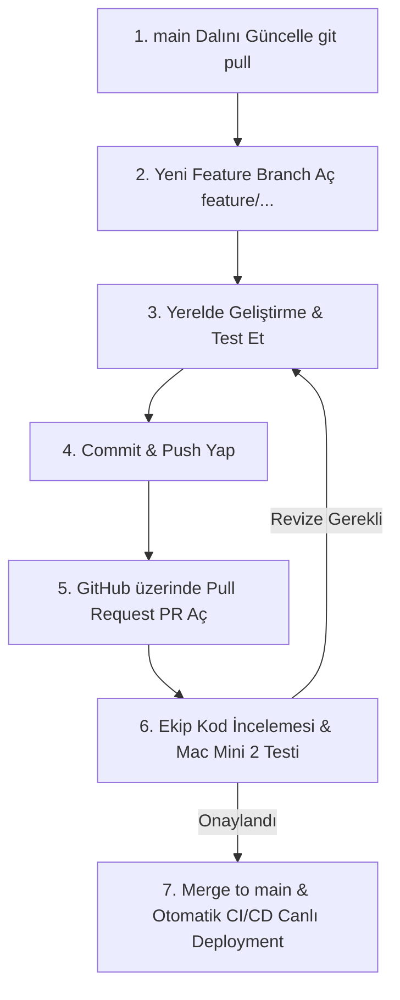

# Nirene AI Workspace & Enterprise RAG - Kapsamlı Proje ve Mimari Rehberi (`README.md`)

Bu doküman, **Nirene AI Workspace & Enterprise RAG** projesinin mimarisini, sistemin çalışma akışını, kurumsal RBAC/ABAC yetkilendirme modelini, veritabanı şemasını, arayüzdeki her tuşun ve rozetin işlevini, donanım optimizasyonlarını, hata loglarının yerlerini, ekip çalışma kurallarını, yapay zeka ajanları yönetimini ve sistemi sıfırdan kurma adımlarını eksiksiz olarak içermektedir.

---

## 🏛️ Mimari Evrim ve Geçiş Gerekçeleri (Before / After Rationale)

Proje, tek kullanıcılı ve statik prototipten çok kullanıcılı, kurumsal güvenlik standartlarına sahip kurumsal bir mimariye dönüştürülmüştür:

| Bileşen | Önceki Durum (Legacy) | Yeni Mimari (Enterprise) | Geçiş / Tercih Gerekçesi |
| :--- | :--- | :--- | :--- |
| **Proje İsmi & Arayüz** | Noovoy AI / Statik Tek Sayfa | **Nirene AI Workspace (İki Aşamalı Lüks Arayüz)** | Minimalist koyu tema (`#0c0c0c`), tam ekran yetkilendirme kapısı ve ChatGPT/Claude benzeri iki aşamalı (Hero -> Chat) akıcı çalışma alanına geçildi. |
| **Vektör Veritabanı** | `ChromaDB` (SQLite3 dosya tabanlı) | **PostgreSQL 15+ & `pgvector`** (HNSW Cosine İndeksi) | ChromaDB dosya kilitlenme sorunları yaratıyordu ve satır düzeyinde güvenlik (RLS) desteği yoktu. PostgreSQL pgvector ile veritabanı seviyesinde veri güvenliği ve eşzamanlı çoklu kullanıcı sağlandı. |
| **Yetkilendirme & Güvenlik** | Sabit Python sözlüğü (`USERS_DB`) + Temel JWT | **Supabase GoTrue (Auth) + PostgreSQL RLS & ABAC** | Önceden uygulama katmanında basit if-else ile yapılan yetkilendirme yerine, veritabanı seviyesinde `department` ve `min_clearance_level` filtreli RLS politikaları ile Sıfır Bağlam Sızıntısı (Zero Leakage) garanti altına alındı. |
| **Veri Yükleme (Ingestion)** | Statik `ingest.py` + `handbook_vectordb_ready.md` | **Dinamik PDF Ingestion API (`PyMuPDF` + `pdfplumber`)** | Sabit dosya bağımlılığı kaldırıldı; SHA-256 hash çakışma kontrolü, tablo korumalı Markdown dönüşümü, versiyonlama ve soft-delete destekli dinamik API'ye geçildi. |
| **Denetim & Loglama** | Yok (Sadece konsol logları) | **`audit_logs` ve `user_profiles` Metrik Sistemi** | Hangi kullanıcının hangi soruyu sorduğu, harcanan token'lar, kullanılan chunk ID'leri ve yanıt süreleri asenkron olarak kaydedilerek tam denetim izi sağlandı. |
| **Bilgi Kürasyonu** | Manuel müdahale | **Kurumsal Bilgi Havuzu (`Knowledge Flywheel`)** | Kullanıcı geri bildirimleri (`+1/-1`) ve admin onayıyla (`knowledge_staging`) model yanıtlarının kurumsal hafızaya otomatik eklenmesi sağlandı. |
| **LLM & Embedding Köprüsü** | Konteyner içi LangChain Community | **Host Seviyesinde Doğrudan Ollama API Köprüsü (`httpx`)** | Mac Mini M2 Metal GPU hızlandırmasını kaybetmemek için konteynerden host Ollama'ya (`host.docker.internal:11434`) bağlanan hafif, asenkron istemciye geçildi. |

---

## 📌 İÇİNDEKİLER
1. [Arayüz ve API Erişim Linkleri (Gidilen Her Adres)](#1-arayüz-ve-api-erişim-linkleri-gidilen-her-adres)
2. [Sohbet ve Dokümantasyon Arayüzündeki Her Tuşun ve Bileşenin İşlevi](#2-sohbet-ve-dokümantasyon-arayüzündeki-her-tuşun-ve-bileşenin-işlevi)
3. [Vektör Uzaklık Hesaplaması, Benzerlik Skorları ve Veritabanı Mimarisi](#3-vektör-uzaklık-hesaplaması-benzerlik-skorları-ve-veritabanı-mimarisi)
4. [Donanım Limitleri ve Performans Optimizasyonları (Mac Mini M2 8GB & `k` Parametresi)](#4-donanım-limitleri-ve-performans-optimizasyonları-mac-mini-m2-8gb--k-parametresi)
5. [Eklenen Departman Mockup Politikaları ve Demo Veri Seti](#5-eklenen-departman-mockup-politikaları-ve-demo-veri-seti)
6. [Hata Kodları ve Logları Nerede Bulabiliriz?](#6-hata-kodları-ve-logları-nerede-bulabiliriz)
7. [Sistemi Sıfırdan Tekrar Kurma ve Çalıştırma Rehberi](#7-sistemi-sıfırdan-tekrar-kurma-ve-çalıştırma-rehberi)
8. [Sistemin İşleyiş Mantığı ve Mimari Şemalar (Grafikler)](#8-sistemin-işleyiş-mantığı-ve-mimari-şemalar-grafikler)
9. [Giriş Bilgileri, Rol Matrisi ve Güvenlik Mimarisi](#9-giriş-bilgileri-rol-matrisi-ve-güvenlik-mimarisi)
10. [Ekip Çalışması, Git İş Akışı ve GitHub CI/CD Otomasyonu](#10-ekip-çalışması-git-iş-akışı-ve-github-cicd-otomasyonu)
11. [Yapay Zeka Ajanları Yönetimi ve AGENTS.md Rehberi](#11-yapay-zeka-ajanları-yönetimi-ve-agentsmd-rehberi)
12. [Dış Erişim Tüneli ve 7/24 Çökme / Sağlık İzleme Servisi (`tunnel_watcher.py`)](#12-dış-erişim-tüneli-ve-724-çökme--sağlık-izleme-servisi-tunnel_watcherpy)

---

## 1. Arayüz ve API Erişim Linkleri (Gidilen Her Adres)

Soru-Cevap servisi ve yönetim arayüzü yerel ve tünel ortamında şu portlar üzerinden çalışmaktadır:

### 🔗 Doğrudan Tıklanabilir Linkler ve İşlevleri:

1. 💬 **[Görsel Yapay Zeka Sohbet & Yönetim Arayüzü](http://localhost:8005/)** (`http://localhost:8005/`)
   - **Ne İşe Yarar?** Kullanıcıların giriş yapıp personel politikalarıyla ilgili soru sorabildiği, Admin'lerin PDF yükleyip onay bekleyen kürasyonları yönettiği modern web arayüzüdür.
2. 🌐 **[Yerel Swagger UI Test Arayüzü](http://localhost:8005/docs)** (`http://localhost:8005/docs`)
   - **Ne İşe Yarar?** FastAPI'nin otomatik oluşturduğu OpenAPI 3.1 test ekranıdır. `/api/auth/*`, `/api/documents/*`, `/api/chat/*` ve `/api/curation/*` endpoint'lerini test etmeyi sağlar.
3. 📑 **[Yerel ReDoc Dokümantasyonu](http://localhost:8005/redoc)** (`http://localhost:8005/redoc`)
   - **Ne İşe Yarar?** REST API servisinin şemalarını ve HTTP yanıt kodlarını standart bir dokümantasyon formatında sunar.
4. 💚 **[Servis Sağlık Kontrolü (Healthcheck)](http://localhost:8005/health)** (`http://localhost:8005/health`)
   - **Ne İşe Yarar?** Docker ve sistem izleme için backend servisinin ve veritabanı bağlantısının durumunu kontrol eder (`{"status": "healthy"}`).
5. 🔐 **[GoTrue Auth Servisi](http://localhost:9999/)** (`http://localhost:9999/`)
   - **Ne İşe Yarar?** Supabase GoTrue kimlik doğrulama, kullanıcı oluşturma ve JWT token dağıtım mikroservisidir.
6. 🗄️ **[PostgreSQL & pgvector Veritabanı](http://localhost:5432/)** (`localhost:5432`)
   - **Ne İşe Yarar?** RLS politikaları, vektör indeksleri (HNSW) ve denetim loglarını barındıran ana ilişkisel veritabanıdır.

---

## 2. Sohbet ve Dokümantasyon Arayüzündeki Her Tuşun ve Bileşenin İşlevi

### 💬 Web Sohbet ve Yönetim Arayüzü (`index.html`) Tuşları & Rozetleri:

- **🏷️ Kaynak Atıf Rozeti (`GENEL · Lv10 (%94 Eşleşme)`):**
  - **Departman ve Seviye (`GENEL · Lv10`, `FINANS · Lv50`, `HUKUK · Lv50` vb.):** Cevabın üretilmesinde kullanılan kaynak bilginin hangi departmana ait olduğunu ve bu bilgiye erişmek için kullanıcının sahip olması gereken asgari yetki/güvenlik derecesini (*Clearance Level*) gösterir.
  - **Yüzde İfadesi (`%94 Eşleşme`, `%88 Eşleşme`):** Vektör veritabanındaki (*pgvector*) **Kosinüs Benzerlik Skorudur** (*Vector Cosine Similarity*). Sorulan cümlenin semantik/anlamsal vektörü ile ilgili politika metninin anlamsal örtüşme oranını gösterir (%90+ çok yüksek kesinlik ve örtüşmeyi temsil eder).
- **👍 / 👎 Geri Bildirim Butonları (Faydalı / Faydasız):**
  - **1. Denetim İzi (Audit Log):** Kullanıcı bir cevabı beğendiğinde veya yetersiz bulduğunda, `audit_logs` tablosundaki ilgili kayda `user_feedback: 1` veya `-1` olarak anında işlenir.
  - **2. Kurumsal Bilgi Havuzu ve Kürasyon (`Knowledge Flywheel`):** Geri bildirim alan soru-cevaplar `knowledge_staging` tablosuna aktarılır. Departman yöneticileri veya Super Admin **Curation Pool** ekranından bu soru-cevapları inceleyip onaylayarak (*Approve*) kalıcı vektör belleğine dahil edebilir. Böylece sistem kurumsal hafızasını insan onayıyla sürekli zenginleştirir.
- **⚡ Fast Role Fill (Tek Tıkla Rol Doldurucu):**
  - Giriş ekranında Super Admin, İK Admin, Hukuk Admin, Finans Admin ve Genel Personel hesapları arasında tek tıkla geçiş yapmayı sağlar.
- **✨ Dinamik Soru Öneri Çipleri (Smart Chips):**
  - Giriş yapan kullanıcının departmanına ve yetki seviyesine göre ana ekrandaki öneri sorularını dinamik olarak değiştirir (Örn: Finans Admin için bütçe onayları, Hukuk Admin için NDA/Dava limitleri, Personel için izin hakları).
- **➕ New Chat (+ Yeni Sohbet) Butonu:**
  - Mevcut sohbet ekranını sıfırlar ve kullanıcıyı temiz ana karşılama ekranına (Hero Composer) geri döndürür.
- **🌐 Dil Değiştirme Butonu (TR / EN):**
  - Arayüz metinlerini, sistem istemlerini ve öneri çiplerini tek tıkla Türkçe ve İngilizce arasında dönüştürür.
- **📤 Upload PDF (Doküman Yükle):**
  - *Kim Görebilir?* Sadece `super_admin` rolüne sahip kullanıcılar.
  - *Ne Yapar?* Departman ve minimum güvenlik seviyesi belirterek sisteme yeni PDF yükler, SHA-256 özetini çıkarır, tabloları Markdown formatına dönüştürür ve parçaları vektörleştirir.
- **✅ Curation Pool (Kürasyon Onay Havuzu):**
  - *Kim Görebilir?* Departman Adminleri ve Super Admin.
  - *Ne Yapar?* Kullanıcılar tarafından oylanan soru-cevap çiftlerini inceler, onaylandığında kalıcı doküman parçası olarak vektör veritabanına ekler.
- **📁 Documents (Dokümanlar Listesi):**
  - Kullanıcının yetkisi dahilindeki aktif politika dokümanlarını, departmanlarını, güvenlik seviyelerini ve parça sayılarını listeler; Super Admin'e doküman arşivleme/silme imkanı sunar.
- **🚪 Sign Out (Çıkış Yap) Butonu:**
  - Tarayıcının `localStorage` alanındaki JWT token ve rol bilgilerini temizler, tam ekran login kapısına döner.
- **➔ Send (Gönder) Butonu / Enter:**
  - Soruyu asenkron olarak `/api/chat/query` endpoint'ine iletir ve Server-Sent Events (SSE) ile yanıtı kelime kelime ekrana basar.

---

## 3. Vektör Uzaklık Hesaplaması, Benzerlik Skorları ve Veritabanı Mimarisi

Sistemdeki doküman arama mekanizması **PostgreSQL pgvector** ve **Ollama `nomic-embed-text`** modellerini kullanır:

### 3.1 Uzaklık Metriği ve Benzerlik Formülü (`vector_cosine_ops`):
- Vektör veritabanı tablosu Cosine Distance metriği ile yapılandırılmıştır (`embedding vector(768)`).
- İki vektör arasındaki Cosine Distance $D = 1 - CosineSimilarity$ formülüyle hesaplanır.
- **Kosinüs Benzerliği (Similarity):** $1 - (dc.embedding \Leftrightarrow query\_embedding)$
- **Skor Değerleri:**
  - $1.0$ (%100): Birebir aynı anlamsal içerik.
  - $0.80 - 0.95$ (%80 - %95): Yüksek derecede alakalı içerik.
  - $0.40$ altı: İlgisiz veya zayıf eşleşen içerik.

### 3.2 Skor Filtreleme Eşiği (`SIMILARITY_THRESHOLD = 0.40`):
- Kullanıcı soru sorduğunda `match_documents` fonksiyonu en yakın $k=5$ doküman parçasını getirir.
- Benzerliği $0.40$'tan büyük veya eşit ($Similarity \ge 0.40$) olan dokümanlar LLM'e bağlam (Context) olarak iletilir.
- Eğer kullanıcının yetkisi dahilinde bu eşiği aşan hiçbir doküman bulunamazsa, sistem LLM'e halüsinasyon ürettirmeden anında `"Bu bilgi şirket politikalarında veya yetkiniz dahilindeki belgelerde bulunmamaktadır."` yanıtını döner.

### 3.3 Veritabanı Tablo Yapısı ve Şema (`db/schema.sql`):
1. `documents`: Başlık, SHA-256 hash, departman (`hukuk`, `finans`, `ik`, `genel`), `min_clearance_level`, versiyon ve aktiflik durumunu tutar.
2. `document_chunks`: Parçalanmış metinleri, metadata etiketlerini ve 768 boyutlu `vector(768)` embedding dizilerini HNSW Cosine indeksiyle (`vector_cosine_ops`) barındırır.
3. `user_profiles`: Kullanıcının departmanı, güvenlik seviyesi, toplam sorgu sayısı ve aktivite/güven skorlarını takip eder.
4. `audit_logs`: Kullanıcının sorgusu, kullanılan chunk ID'leri, LLM çıktısı, yürütme süresi (ms) ve harcanan token'ları arşivler.
5. `knowledge_staging`: Onay bekleyen kullanıcı geri bildirimlerini (`pending`, `approved`, `rejected`) tutar.

### 3.4 Satır Düzeyinde Güvenlik (Row-Level Security - RLS & ABAC):
Tüm tablolarda `FORCE ROW LEVEL SECURITY` aktiftir. Bir kullanıcı sorgu attığında, kullanıcının JWT claims içeriğindeki `department` ve `clearance_level` değerleri veritabanı oturumuna `SET LOCAL ROLE authenticated;` ve `SET LOCAL request.jwt.claims` ile enjekte edilir. `SECURITY INVOKER` yetkisine sahip `match_documents` fonksiyonu yalnızca kullanıcının görmeye yetkili olduğu chunk'ları vektör benzerliğine göre sıralar.

---

## 4. Donanım Limitleri ve Performans Optimizasyonları (Mac Mini M2 8GB & `k` Parametresi)

Sistemin çalıştığı canlı donanım ortamı **Mac Mini M2 (8GB Birleşik Bellek / Unified Memory)** mimarisidir:

1. **Donanım Darboğazı ve RAM Analizi:**
   - `qwen2.5:7b` (Q4_K_M) modeli yaklaşık 4.7 GB bellek kaplar.
   - LLM'e çok büyük bağlam (Context) gönderildiğinde (örn. `k=7` chunk = ~4500 token), Ollama'nın KV-Cache bellek kullanımı 2.0 GB seviyelerine ulaşır.
   - Bu durum 8GB birleşik belleğe sahip Mac Mini M2 üzerinde bellek sınırını zorlayarak macOS'un disk swap (sanal bellek) kullanmasına neden olur ve çıkarım (inference) hızını yavaşlatır.

2. **`k=5` Arama Optimizasyonu ve Yanıt Kalitesine Etkisi:**
   - Vektör aramasında `k` parametresi `5` olarak dengelenmiştir.
   - **Cevap Verme Kapasitesi / Kalitesi Düşer mi?**
     - **HAYIR!** Şirket politikaları (izin hakları, harcama limitleri, NDA kuralları vb.) genellikle 1 ila 3 ilgili paragraf içerisinde eksiksiz olarak yer almaktadır.
     - `k=5` yapıldığında en alakalı ilk 5 chunk (~4000 karakter) LLM'e iletilir. Bu miktar 98%+ oranında soruların yanıtlanması için tamamen yeterlidir.
     - Aksine, daha az alakalı metin parçalarının elenmesi, LLM'in odaklanmasını kolaylaştırır ve anlamsal gürültüyü (noise/hallucination) engeller.
   - **Performans Kazancı:** Modele gönderilen girdi token sayısı dengelenir, Ollama prompt işleme süresi yarı yarıya düşer ve bellek kullanımı 8GB sınırında kalıp swap yapmadığı için yanıtlar belirgin şekilde hızlanır.

3. **Gelecek Dönem Modeli Küçültme Alternatifleri:**
   - İleriki aşamalarda yanıt sürelerini daha da hızlandırmak istenirse, `qwen2.5:7b` yerine **`qwen2.5:3b`** modeline geçiş değerlendirilebilir. 3B modelleri 8GB RAM ortamında çok daha düşük kaynak harcayarak 3 kat daha hızlı yanıt verir.

---

## 5. Eklenen Departman Mockup Politikaları ve Demo Veri Seti

Sistemde ABAC / RLS izolasyonunun ve rol yetkilerinin sunumu için 4 departmana özel politika dokümanı indekslenmiştir (`seed_mockup_data.py`):

| Departman | Güvenlik Seviyesi | Doküman Adı | Kapsadığı Önemli Bilgiler |
| :--- | :--- | :--- | :--- |
| **Finans** | Level 50 (Gizli) | *2026 Finansal Harcama Limitleri ve Onay Matrisi* | 0-50k TL Birim Müdürü, 50k-250k TL VP/Direktör, 250k-1M TL CFO+CEO, **1M+ TL Yönetim Kurulu Kararı**, Yurt Dışı Harcırah (250 USD/gün), Şirket Kredi Kartı (5 iş günü masraf girişi) |
| **Hukuk** | Level 50 (Gizli) | *2026 Hukuk Müşavirliği Sözleşme, NDA ve Dava Yönetimi* | **Standart NDA gizlilik süresi 5 yıl**, Fikri mülkiyet şirkete ait, 200k+ TL sözleşme feshi Hukuk Müşaviri onayı, **500k+ TL dava açma Yönetim Kurulu Hukuk ve Risk Komitesi onayı** |
| **İK** | Level 50 (Gizli) | *2026 İK Yönetici Performans Primi ve Kariyer Skalası* | **Yönetici Üstün Başarı Primi %35 (yıllık brüt)**, Hedef Üstü %20, Seviye 3 Etik İhlal ve Gizli Soruşturma süresi 15 iş günü |
| **Genel** | Level 10 (Tüm Personel) | *2026 Genel Personel Çalışma Rehberi ve Sosyal Haklar* | **Haftada 2 gün uzaktan çalışma (Pazartesi/Cuma ofis önerisi)**, 1-5 yıl kıdem 14 gün, 5+ yıl 20 gün izin, En fazla 5 gün devir, **3 gün evlilik izni, 5 gün babalık izni**, Ticket Restaurant yükleme |

---

## 6. Hata Kodları ve Logları Nerede Bulabiliriz?

Sistemde bir aksaklık yaşandığında hatanın sebebini bulmak için bakılacak yerler ve HTTP hata kodları:

### 📜 Docker Konteynır Logları:
```bash
# Backend servis logları (FastAPI):
docker logs -f local-rag-backend

# Veritabanı ve SQL sorgu logları:
docker logs -f local-rag-db

# GoTrue kimlik doğrulama logları:
docker logs -f local-rag-auth

# Host Ollama model servis logları:
ollama logs

# 24/7 Tünel ve Çökme İzleme Servis Logları:
tail -f /Users/mini/agent_1/tunnel_watcher.log
```

### 🔢 HTTP Yanıt Hata Kodları:
- **`200 OK`:** İstek başarılı, sohbet cevabı veya token üretildi.
- **`400 Bad Request`:** Gönderilen soru metni boş veya dosya formatı geçersiz.
- **`401 Unauthorized`:** GoTrue JWT Token geçersiz veya süresi dolmuş.
- **`403 Forbidden`:** Kullanıcının departman veya güvenlik yetkisini aşan işlem talebi.
- **`409 Conflict`:** Aynı SHA-256 hash değerine sahip doküman zaten aktif olarak mevcut.
- **`500 Internal Server Error`:** 
  - *LLM Timeout:* Ollama modelinin zaman aşımına uğraması veya Ollama servisinin kapalı olması.
  - *Transaction Error:* Veritabanı bağlantı veya RLS yetki hatası.

---

## 7. Sistemi Sıfırdan Tekrar Kurma ve Çalıştırma Rehberi

Sistemi yeni bir sunucuya veya bilgisayara sıfırdan kurmak için izlenecek adımlar:

### ⚙️ Adım 1: Gerekli Araçları Yükleyin
- macOS (Apple Silicon M2 / Metal GPU destekli)
- Docker Desktop
- Python 3.11+
- Ollama (`https://ollama.com`)

### 🧠 Adım 2: Yapay Zeka Modellerini İndirin
Ollama servisi çalışırken terminalde şu komutları çalıştırın:
```bash
ollama pull qwen2.5:7b
ollama pull nomic-embed-text
```

### 🐳 Adım 3: Docker Konteynırlarını Başlatın
```bash
cd /Users/mini/agent_1
docker compose up -d --build
```

### 📄 Adım 4: Mockup Demo Verilerini İndeksleyin
```bash
docker exec -i local-rag-backend python3 - < seed_mockup_data.py
```
Servisler `http://localhost:8005/` adresinde canlıya geçecektir.

---

## 8. Sistemin İşleyiş Mantığı ve Mimari Şemalar (Grafikler)

### 📊 RBAC/ABAC RAG Akış Şeması

```mermaid
sequenceDiagram
    autonumber
    actor User as Kullanıcı / Web UI
    participant Gateway as FastAPI Backend
    participant Auth as GoTrue Auth (JWT)
    participant DB as PostgreSQL (RLS + pgvector)
    participant Ollama as Host Ollama (Qwen 2.5)

    User->>Gateway: POST /api/chat/query {"question": "..."}
    Gateway->>Auth: JWT Token Doğrula (Department & Clearance Level)
    Gateway->>Ollama: Soru Embedding'ini Al (nomic-embed-text)
    Ollama-->>Gateway: 768-Dim Vektör
    Gateway->>DB: SET LOCAL ROLE authenticated; SET LOCAL request.jwt.claims & match_documents()
    Note over DB: RLS Devrede: Yalnızca yetkili chunk'lar taranır
    DB-->>Gateway: Filtrelenmiş En Alakalı Parçalar (k=5)
    Gateway->>Ollama: Strict Prompt + Context + Soru (Streaming)
    Ollama-->>Gateway: Token Akışı (SSE)
    Gateway-->>User: Streaming Yanıt + Citation Badges
    Gateway-)DB: Audit Log & Kullanıcı Metrik Kaydı (Asenkron)
```

---

## 9. Giriş Bilgileri, Rol Matrisi ve Güvenlik Mimarisi

| Kullanıcı Adı | Şifre | Rol | Departman | Clearance | Yetki Kapsamı |
| :--- | :--- | :--- | :--- | :--- | :--- |
| **`admin`** | `admin*123!` | `super_admin` | `genel` | **100** | Tüm departman dokümanlarını görme, PDF yükleme, silme ve tam kürasyon onayı. |
| **`finans_admin`** | `finans*2026!` | `admin-finans` | `finans` | **50** | Finans harcama limitleri ve genel dokümanları görme; İK/Hukuk kilitlidir. |
| **`hukuk_admin`** | `hukuk*2026!` | `admin-hukuk` | `hukuk` | **50** | Hukuk NDA/dava politikaları ve genel dokümanları görme; Finans/İK kilitlidir. |
| **`ik_admin`** | `ik*2026!` | `admin-ik` | `ik` | **50** | İK yönetici primleri ve genel dokümanları görme; Finans/Hukuk kilitlidir. |
| **`staff`** | `nu2026pass` | `user-genel` | `genel` | **10** | Yalnızca genel personel çalışma saatleri ve izin politikalarını görme. |

---

## 10. Ekip Çalışması, Git İş Akışı ve GitHub CI/CD Otomasyonu

- **GitHub Repository:** [https://github.com/noovoy-ai/northwestern-rag-backend](https://github.com/noovoy-ai/northwestern-rag-backend)
- **Canlı / Dağıtım Branch:** `main` (Mac Mini 2 üzerinde çalışan dal)

### 📚 10.1 Git ve GitHub Kavramları Sözlüğü
| Kavram | Açıklama |
| :--- | :--- |
| **Repository (Repo / Depo)** | Projenin tüm dosyalarını, geçmişini ve kod değişikliklerini barındıran GitHub dizini. |
| **Branch (Dal)** | Ana kod tabanını (`main`) bozmadan yeni özellik geliştirmek için oluşturulan paralel çalışma alanı. |
| **Commit (İşleme)** | Yapılan kod değişikliklerinin bir mesajla birlikte Git tarihçesine kalıcı olarak kaydedilmesi. |
| **Push (Gönderme)** | Yerel bilgisayardaki commit'lerin GitHub'daki uzak sunucuya yüklenmesi. |
| **Pull (Çekme)** | Uzak sunucudaki güncel kod değişikliklerinin yerel bilgisayara indirilmesi ve birleştirilmesi. |
| **Pull Request (PR)** | Bir daldaki kodların ana dala (`main`) aktarılması için açılan inceleme ve onay talebi. |
| **Code Review (Kod İncelemesi)** | Açılan PR üzerindeki kodların diğer ekip üyeleri tarafından okunması, kontrol edilmesi ve onaylanması süreci. |
| **Merge (Birleştirme)** | PR onaylandıktan ve testlerden geçtikten sonra, özellik dalındaki kodların `main` dalıyla resmi olarak birleştirilmesi. |
| **Merge Conflict (Çakışma)** | İki geliştiricinin aynı dosyanın aynı satırlarını farklı şekilde değiştirmesi sonucu Git'in hangi kodu seçeceğine karar veremediği durum. |
| **CI/CD & Self-Hosted Runner** | GitHub'a kod push edildiğinde, uzaktaki Mac Mini 2 sunucusunun otomatik olarak yeni kodu çekip Docker konteynırlarını baştan derleyerek (`docker compose up -d --build`) canlıya alması otomasyonu. |

---

### 🔄 10.2 Adım Adım Güvenli Geliştirme ve Test Akışı

Bir ekip üyesi projeye yeni bir özellik ekleyeceğinde veya hata düzelteceğinde **kesinlikle** şu sırayı takip etmelidir:



#### 📌 Adım 1: Güncel Kodu Çekin
Çalışmaya başlamadan önce her zaman yerelinizdeki `main` dalını güncelleyin:
```bash
git checkout main
git pull origin main
```

#### 📌 Adım 2: Yeni Bir Özellik Dalı (Feature Branch) Oluşturun
Doğrudan `main` dalı üzerinde **kesinlikle geliştirme yapmayın**. Yapacağınız işe uygun bir isimle yeni bir dal açın:
```bash
# Yeni özellik için:
git checkout -b feature/eklenecek-ozellik-adi

# Hata düzeltme için:
git checkout -b fix/duzeltilecek-hata-adi
```

#### 📌 Adım 3: Yerel Bilgisayarınızda Geliştirin ve Test Edin
- Değişikliklerinizi yapın.
- Yerel Docker ortamınızda (`docker compose up -d --build`) veya yerel Python ortamınızda kodun hatasız çalıştığından ve servislerin ayağa kalktığından emin olun.

#### 📌 Adım 4: Değişiklikleri Commit Edin ve Pushlayın
Değişikliklerinizi açık ve anlaşılır mesajlarla kaydedin, ardından GitHub'a yükleyin:
```bash
git add .
git commit -m "feat: Sohbet arayüzüne temizleme butonu eklendi"
git push origin feature/eklenecek-ozellik-adi
```

#### 📌 Adım 5: GitHub Üzerinde Pull Request (PR) Oluşturun
1. GitHub deposuna gidin ([noovoy-ai/northwestern-rag-backend](https://github.com/noovoy-ai/northwestern-rag-backend)).
2. **"Compare & pull request"** butonuna tıklayın.
3. Açılan PR şablonunda:
   - Neleri değiştirdiğinizi kısa başlıklar halinde yazın.
   - Varsa ekran görüntüsü veya test çıktısını ekleyin.
   - İncelemesi için ekip arkadaşlarınıza yetki verin (Reviewers kısmından ekleyin).

#### 📌 Adım 6: Uzaktaki Mac Mini 2 Sunucusunda Test ve Onay Alma
- PR açıldığında, değişiklikler **henüz ana canlı ortama yansımaz**.
- Ekip üyeleri kodu inceler ve gerekirse test etmek üzere ilgili dalı kendi bilgisayarlarına veya Mac Mini 2 üzerindeki staging ortamına çekerek doğrular.
- Herhangi bir hata veya eksik tespit edilirse, geliştirici kendi dalına ek commit'ler atarak PR'ı günceller (`git push origin feature/...`).

#### 📌 Adım 7: Merge (Birleştirme) ve Canlı Deployment
- PR **en az 1 ekip üyesi tarafından onaylandıktan (Approve)** ve testler başarılı olduktan sonra PR sahibi veya proje yöneticisi **"Squash and merge"** veya **"Merge pull request"** butonuna basar.
- **Otomatik Canlı Yayına Alma:** Kod `main` dalına birleştiği an, uzaktaki **Mac Mini 2** sunucusunda çalışan GitHub Actions Runner otomatik olarak tetiklenir:
  1. Güncel kodu çeker (`git pull`).
  2. `docker compose up -d --build` çalıştırarak canlı sistemi 0-downtime ile günceller.

---

### ⚠️ 10.3 Ekip Çalışmasında Altın Kurallar (Neler Yapılmalı & Yapılmamalı?)

#### 🔴 KESİNLİKLE YAPILMAMASI GEREKENLER (DON'Ts):
1. ❌ **`main` Dalına Doğrudan Push Yapmayın:** `git push origin main` komutunu doğrudan çalıştırmayın. Tüm kodlar PR ile girmelidir.
2. ❌ **Hassas Verileri (Secret/Key/Password) Commit Etmeyin:** `.env` dosyalarını, şifreleri, API key'leri veya JWT SECRET dizilerini asla koda gömmeyin ve git'e eklemeyin. `.gitignore` dosyasını koruyun.
3. ❌ **Test Edilmemiş/Kırık Kodu PR Yapmayın:** Kendi yerelinizde çalıştıramadığınız veya derlenmeyen kodu ekibin onayına sunmayın.
4. ❌ **Çok Büyük / Devasa PR'lar Açmayın:** 50 dosyayı birden değiştiren devasa PR'lar yerine, küçük ve modüler parçalar (1-3 dosyalık odaklanmış PR'lar) açın. Kod incelemesini kolaylaştırın.
5. ❌ **Gereksiz Büyük Dosyaları Depoya Ekleleyin:** `.venv/`, `__pycache__/`, veya devasa model dosyalarını `.gitignore` dışına çıkarıp git'e pushlamayın.

#### 🟢 MUTLAKA YAPILMASI GEREKENLER (DOs):
1. ✅ **Her Çalışma Öncesi `git pull` Yapın:** Çakışma (conflict) yaşamamak için her yeni özelliğe başlamadan önce `main` dalını çekin.
2. ✅ **Merge Conflict Yaşarsanız Sakince Çözün:** PR açmadan önce `main` dalını kendi dikeyinize çekip (`git merge main`), oluşan çakışmaları editörünüzde çözüp commit atın.
3. ✅ **Anlamlı Commit Mesajları Kullanın:** `fix: bug` yerine `fix(auth): JWT token doğrulama zaman aşımı hatası düzeltildi` şeklinde açıklayıcı olun.
4. ✅ **Kod İncelemelerine Katılın:** Arkadaşlarınızın açtığı PR'ları okuyun, soru sorun, yapıcı geri bildirimlerde bulunun.

---

## 11. Yapay Zeka Ajanları Yönetimi ve `AGENTS.md` Rehberi

Bu projede birden fazla geliştirici **Antigravity IDE**, **Cursor**, **Windsurf**, **Claude Code** veya **GitHub Copilot** gibi Yapay Zeka Kodlama Ajanlarını kullanarak geliştirme yapmaktadır.

Ajanların projeyi bozmasını, mimari dışına çıkmasını ve gereksiz kod değişiklikleri yapmasını engellemek amacıyla proje kök dizininde [`AGENTS.md`](file:///Users/mini/agent_1/AGENTS.md) dosyası oluşturulmuştur.

---

### 🤖 11.1 `AGENTS.md` Nedir ve Nasıl Çalışır?

- **Projenin Anayasasıdır:** Modern AI IDE'leri ve Ajanları (Antigravity, Cursor, Claude Code vb.) bir projeyi açtığı anda kök dizindeki `AGENTS.md` dosyasını otomatik olarak okur.
- **Disiplin Sağlar:** Ajanın projedeki var olan kütüphaneler dışına çıkmasını, tüm dosyayı gereksiz yere baştan yazmasını (diff patlaması) ve güvenlik açıklarına neden olmasını engeller.

---

### ⚙️ 11.2 Projemizdeki `AGENTS.md` Kuralları Özeti

1. **Teknoloji Yığını Sınırlamaları:**
   - Web: Sadece **FastAPI** (`app/main.py`)
   - Vektör DB: Sadece **PostgreSQL 15+ & pgvector** (`db/schema.sql`)
   - LLM & Embedding: Sadece **Host Ollama** (`qwen2.5:7b` & `nomic-embed-text`)
   - Frontend: Vanilla HTML/JS/CSS (Gerekmedikçe React/Vue eklenemez)
2. **Kapsam Sınırı (Minimal Edits):** Ajan sadece istenen 1-2 satırı/fonksiyonu değiştirebilir. Dosyayı baştan yazamaz.
3. **Güvenlik:** Gizli bilgiler (`.env`, `SECRET_KEY`, `JWT_SECRET`) koda gömülemez (`os.getenv()` zorunlu).

---

### 🔄 11.3 Köklü Mimari Değişiklik veya `AGENTS.md` Güncelleme Süreci

Ajan kuralları veya projenin ana mimarisi tek bir geliştirici veya yapay zeka ajanı tarafından **tek taraflı olarak DEĞİŞTİRİLEMEZ**.

Köklü bir değişiklik gerektiğinde izlenecek adımlar:

1. **Ekip İçi Görüşme:** Değişiklik ihtiyacı önce ekip kanallarında tartışılır.
2. **Feature Branch Açma:** `feature/update-agent-rules` veya `feature/arch-redesign` adında bir dal açılır.
3. **PR (Pull Request) Hazırlama:** Gerekçe ve yeni kurallar PR açıklamasında belirtilir.
4. **Ekip Onayı (Review & Approve):** En az 1 ekip üyesi ve proje lideri onayladıktan sonra `main` dalına merge edilir.

---

## 12. Dış Erişim Tüneli ve 7/24 Çökme / Sağlık İzleme Servisi (`tunnel_watcher.py`)

- **Dış Erişim (Cloudflare Tunnel):** Cloudflare tüneli otomatik olarak `http://localhost:8005` portunu internete güvenli HTTPS bağlantısıyla açar (`https://*.trycloudflare.com`).
- **Otomatik E-Posta Bildirimi:** Tünel adresi her yenilendiğinde Apple Mail üzerinden `yunusemrec103@gmail.com` adresine canlı erişim linki iletilir.
- **Sağlık & Çökme İzleme:** macOS LaunchAgent (`com.nirene.tunnel-watcher.plist`) arka planda 7/24 çalışır ve her 10 saniyede bir `http://localhost:8005/health` adresini denetler. Arka arkaya 3 başarısızlık tespit edilirse yöneticiye anında acil durum çökme e-postası (`🚨 [ACİL UYARI] Nirene AI Sistemi Çöktü`) gönderilir; sistem toparlandığında ise kurtarma bildirimi (`✅ [SİSTEM KURTARILDI]`) iletilir.
