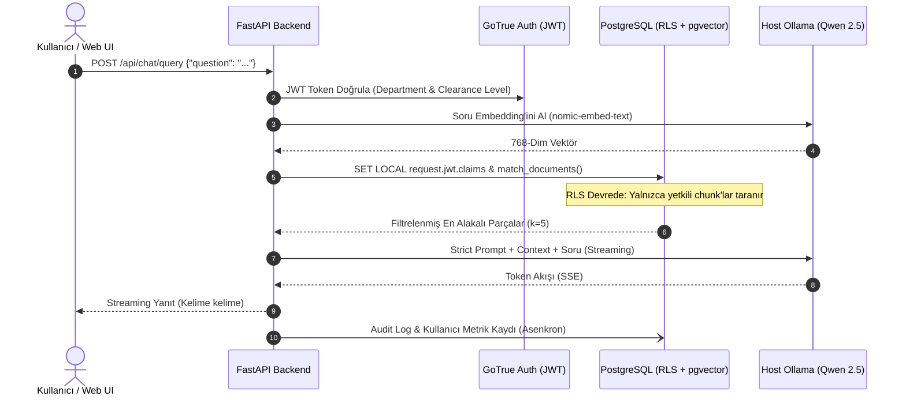

# Northwestern Staff Handbook RAG - Tam Proje, Mimari, Buton & Link Rehberi (`README.md`)

Bu doküman, **Northwestern University Staff Handbook RAG** projesinin mimarisini, sistemin çalışma akışını, kurumsal RBAC/ABAC yetkilendirme modelini, veritabanı şemasını, arayüzdeki her tuşun işlevini, hata loglarının yerlerini ve sistemi sıfırdan kurma adımlarını içermektedir.

---

## 🏛️ Mimari Evrim ve Geçiş Gerekçeleri (Before / After Rationale)

Proje, tek kullanıcılı ve statik prototipten çok kullanıcılı, kurumsal güvenlik standartlarına sahip kurumsal bir mimariye dönüştürülmüştür:

| Bileşen | Önceki Durum (Legacy) | Yeni Mimari (Enterprise) | Geçiş / Tercih Gerekçesi |
| :--- | :--- | :--- | :--- |
| **Vektör Veritabanı** | `ChromaDB` (SQLite3 dosya tabanlı) | **PostgreSQL 15+ & `pgvector`** (HNSW Cosine İndeksi) | ChromaDB dosya kilitlenme sorunları yaratıyordu ve satır düzeyinde güvenlik (RLS) desteği yoktu. PostgreSQL pgvector ile veritabanı seviyesinde veri güvenliği ve eşzamanlı çoklu kullanıcı sağlandı. |
| **Yetkilendirme & Güvenlik** | Sabit Python sözlüğü (`USERS_DB`) + Temel JWT | **Supabase GoTrue (Auth) + PostgreSQL RLS & ABAC** | Önceden uygulama katmanında basit if-else ile yapılan yetkilendirme yerine, veritabanı seviyesinde `department` ve `min_clearance_level` filtreli RLS politikaları ile Sıfır Bağlam Sızıntısı (Zero Leakage) garanti altına alındı. |
| **Veri Yükleme (Ingestion)** | Statik `ingest.py` + `handbook_vectordb_ready.md` | **Dinamik PDF Ingestion API (`PyMuPDF` + `pdfplumber`)** | Sabit dosya bağımlılığı kaldırıldı; SHA-256 hash çakışma kontrolü, tablo korumalı Markdown dönüşümü, versiyonlama ve soft-delete destekli dinamik API'ye geçildi. |
| **Denetim & Loglama** | Yok (Sadece konsol logları) | **`audit_logs` ve `user_profiles` Metrik Sistemi** | Hangi kullanıcının hangi soruyu sorduğu, harcanan token'lar, kullanılan chunk ID'leri ve yanıt süreleri asenkron olarak kaydedilerek tam denetim izi sağlandı. |
| **Bilgi Kürasyonu** | Manuel müdahale | **Kurumsal Bilgi Havuzu (`Knowledge Flywheel`)** | Kullanıcı geri bildirimleri (`+1/-1`) ve admin onayıyla (`knowledge_staging`) model yanıtlarının kurumsal hafızaya otomatik eklenmesi sağlandı. |
| **LLM & Embedding Köprüsü** | Konteyner içi LangChain Community | **Host Seviyesinde Doğrudan Ollama API Köprüsü (`httpx`)** | Mac Mini M2 Metal GPU hızlandırmasını kaybetmemek için konteynerden host Ollama'ya (`host.docker.internal:11434`) bağlanan hafif, asenkron istemciye geçildi. |

---

## 📌 İÇİNDEKİLER
1. [Arayüz ve API Erişim Linkleri (Gidilen Her Adres)](#1-arayüz-ve-api-erişim-linkleri-gidilen-her-adres)
2. [Sohbet ve Dokümantasyon Arayüzündeki Her Tuşun İşlevi](#2-sohbet-ve-dokümantasyon-arayüzündeki-her-tuşun-işlevi)
3. [Veritabanı Mimarisi, RLS Güvenliği ve Vektör Arama](#3-veritabanı-mimarisi-rls-güvenliği-ve-vektör-arama)
4. [Hata Kodları ve Logları Nerede Bulabiliriz?](#4-hata-kodları-ve-logları-nerede-bulabiliriz)
5. [Sistemi Sıfırdan Tekrar Kurma ve Çalıştırma Rehberi](#5-sistemi-sıfırdan-tekrar-kurma-ve-çalıştırma-rehberi)
6. [Sistemin İşleyiş Mantığı ve Mimari Şemalar (Grafikler)](#6-sistemin-işleyiş-mantığı-ve-mimari-şemalar-grafikler)
7. [Giriş Bilgileri, Rol Matrisi ve Güvenlik Mimarisi](#7-giriş-bilgileri-rol-matrisi-ve-güvenlik-mimarisi)
8. [Ekip Çalışması, Git İş Akışı ve GitHub CI/CD Otomasyonu](#8-ekip-çalışması-git-iş-akışı-ve-github-cicd-otomasyonu)
9. [Yapay Zeka Ajanları Yönetimi ve AGENTS.md Rehberi](#9-yapay-zeka-ajanları-yönetimi-ve-agentsmd-rehberi)

---

## 1. Arayüz ve API Erişim Linkleri (Gidilen Her Adres)

Soru-Cevap servisi ve yönetim arayüzü yerel ve tünel ortamında şu portlar üzerinden çalışmaktadır:

### 🔗 Doğrudan Tıklanabilir Linkler ve İşlevleri:

1. 💬 **[Görsel Yapay Zeka Sohbet & Yönetim Arayüzü](http://localhost:8005/)** (`http://localhost:8005/`)
   - **Ne İşe Yarar?** Kullanıcıların giriş yapıp personel el kitabıyla ilgili soru sorabildiği, Admin'lerin PDF yükleyip onay bekleyen kürasyonları yönettiği modern web arayüzüdür.
2. 🌐 **[Yerel Swagger UI Test Arayüzü](http://localhost:8005/docs)** (`http://localhost:8005/docs`)
   - **Ne İşe Yarar?** FastAPI'nin otomatik oluşturduğu OpenAPI 3.1 test ekranıdır. `/api/auth/*`, `/api/documents/*`, `/api/chat/*` ve `/api/curation/*` endpoint'lerini test etmeyi sağlar.
3. 📑 **[Yerel ReDoc Dokümantasyonu](http://localhost:8005/redoc)** (`http://localhost:8005/redoc`)
   - **Ne İşe Yarar?** REST API servisinin şemalarını ve HTTP yanıt kodlarını standart bir dokümantasyon formatında sunar.
4. 💚 **[Servis Sağlık Kontrolü (Healthcheck)](http://localhost:8005/health)** (`http://localhost:8005/health`)
   - **Ne İşe Yarar?** Docker ve sistem izleme için backend servisinin ve veritabanı bağlantısının durumunu kontrol eder (`{"status": "healthy"}`).
5. 🔐 **[GoTrue Auth Servisi](http://localhost:9999/)** (`http://localhost:9999/`)
   - **Ne İşe Yarar?** Supabase GoTrue kimlik doğrulama, kullanıcı oluşturma ve JWT token dağıtım mikroservisidir.
6. 🗄️ **[PostgreSQL & pgvector Veritabanı](http://localhost:5432/)** (`localhost:5432`)
   - **Ne İşe Yarar?** RLS politikaları, vektör indeksleri (HNSW) ve denetim loglarını barındıran ana ilişkisel veritabanıdır.

---

## 2. Sohbet ve Dokümantasyon Arayüzündeki Her Tuşun İşlevi

### 💬 Web Sohbet ve Yönetim Arayüzü (`index.html`) Tuşları:

- **📤 Upload PDF (Doküman Yükle):**
  - *Kim Görebilir?* Sadece `super_admin` rolüne sahip kullanıcılar.
  - *Ne Yapar?* Departman ve minimum güvenlik seviyesi belirterek sisteme yeni PDF yükler, SHA-256 özetini çıkarır, tabloları Markdown formatına dönüştürür ve parçaları vektörleştirir.
- **✅ Curation Pool (Kürasyon Onay Havuzu):**
  - *Kim Görebilir?* Departman Adminleri ve Super Admin.
  - *Ne Yapar?* Kullanıcılar tarafından oylanan veya düzeltilen soru-cevap çiftlerini inceler, onaylandığında kalıcı doküman parçası olarak vektör veritabanına ekler.
- **🚪 Logout (Çıkış Yap) Butonu:**
  - *Ne Yapar?* Tarayıcının `localStorage` alanındaki JWT token ve rol bilgilerini temizler, login ekranına döner.
- **👍 / 👎 Geri Bildirim Butonları (Feedback):**
  - *Ne Yapar?* Üretilen her cevabın altına eklenen butonlar sayesinde kullanıcı yanıtın doğruluğunu puanlar ve `audit_logs` / `knowledge_staging` tablolarını besler.
- **➔ Send (Gönder) Butonu / Enter:**
  - *Ne Yapar?* Soruyu asenkron olarak `/api/chat/query` endpoint'ine iletir ve Server-Sent Events (SSE) ile yanıtı kelime kelime ekrana basar.

---

## 3. Veritabanı Mimarisi, RLS Güvenliği ve Vektör Arama

Sistem, veritabanı olarak **Supabase PostgreSQL 15+ ve pgvector** eklentisini kullanır:

### 3.1 Tablo Yapısı ve Şema (`db/schema.sql`):
1. `documents`: Başlık, SHA-256 hash, departman (`hukuk`, `finans`, `ik`, `genel`), `min_clearance_level`, versiyon ve aktiflik durumunu tutar.
2. `document_chunks`: Parçalanmış metinleri, metadata etiketlerini ve 768 boyutlu `vector(768)` embedding dizilerini HNSW Cosine indeksiyle (`vector_cosine_ops`) barındırır.
3. `user_profiles`: Kullanıcının departmanı, güvenlik seviyesi, toplam sorgu sayısı ve aktivite/güven skorlarını takip eder.
4. `audit_logs`: Kullanıcının sorgusu, kullanılan chunk ID'leri, LLM çıktısı, yürütme süresi (ms) ve harcanan token'ları arşivler.
5. `knowledge_staging`: Onay bekleyen kullanıcı geri bildirimlerini (`pending`, `approved`, `rejected`) tutar.

### 3.2 Satır Düzeyinde Güvenlik (Row-Level Security - RLS):
Tüm tablolarda RLS aktiftir. Bir kullanıcı sorgu attığında, kullanıcının JWT claims içeriğindeki `department` ve `clearance_level` değerleri veritabanı oturumuna enjekte edilir. `SECURITY INVOKER` yetkisine sahip `match_documents` fonksiyonu yalnızca kullanıcının görmeye yetkili olduğu chunk'ları vektör benzerliğine göre sıralar.

---

## 4. Hata Kodları ve Logları Nerede Bulabiliriz?

### 📜 Docker Konteynır Logları:
```bash
# Backend servis logları (FastAPI):
docker logs -f local-rag-backend

# Veritabanı ve SQL sorgu logları:
docker logs -f local-rag-db

# GoTrue kimlik doğrulama logları:
docker logs -f local-rag-auth

# Host Ollama model servis logları:
ollama logs
```

### 🔢 HTTP Yanıt Hata Kodları:
- **`200 OK`:** İstek başarılı, sohbet cevabı veya token üretildi.
- **`400 Bad Request`:** Gönderilen soru metni boş veya dosya formatı geçersiz.
- **`401 Unauthorized`:** GoTrue JWT Token geçersiz veya süresi dolmuş.
- **`403 Forbidden`:** Kullanıcının departman veya güvenlik yetkisini aşan işlem talebi.
- **`409 Conflict`:** Aynı SHA-256 hash değerine sahip doküman zaten aktif olarak mevcut.
- **`500 Internal Server Error`:** Ollama bağlantı hatası veya veritabanı transaction hatası.

---

## 5. Sistemi Sıfırdan Tekrar Kurma ve Çalıştırma Rehberi

### ⚙️ Adım 1: Gereksinimleri Kontrol Edin
- macOS (Apple Silicon M2 / Metal GPU destekli)
- Docker Desktop
- Python 3.11+
- Ollama (`/opt/homebrew/bin/ollama`)

### 🧠 Adım 2: Ollama Modellerini Hazırlayın
```bash
ollama pull qwen2.5:7b
ollama pull nomic-embed-text
```

### 🐳 Adım 3: Docker Konteynırlarını Başlatın
```bash
cd /Users/mini/agent_1
docker compose up -d --build
```
Servisler `http://localhost:8005/` adresinde çalışacaktır.

---

## 6. Sistemin İşleyiş Mantığı ve Mimari Şemalar (Grafikler)

### 📊 RBAC/ABAC RAG Akış Şeması



---

## 7. Giriş Bilgileri, Rol Matrisi ve Güvenlik Mimarisi

| Rol Adı | Departman | Güvenlik Seviyesi (Clearance) | Yetki Kapsamı |
| :--- | :--- | :--- | :--- |
| **`super_admin`** | Tüm Departmanlar | 100 | Tüm dokümanları görme, yeni PDF yükleme, silme ve tam kürasyon onayı. |
| **`admin-finans`** | `finans` / `genel` | 50 | Finans ve genel dokümanları görme, finans kürasyonlarını onaylama. |
| **`admin-hukuk`** | `hukuk` / `genel` | 50 | Hukuk ve genel dokümanları görme, hukuk kürasyonlarını onaylama. |
| **`user-ik`** | `ik` / `genel` | 10 | Yalnızca IK ve genel el kitabı dokümanları üzerinden soru sorma. |
| **`user-genel`** | `genel` | 10 | Yalnızca genel personel politikaları üzerinden soru sorma. |

---

## 8. Ekip Çalışması, Git İş Akışı ve GitHub CI/CD Otomasyonu

- **GitHub Repository:** [https://github.com/noovoy-ai/northwestern-rag-backend](https://github.com/noovoy-ai/northwestern-rag-backend)
- **Canlı / Dağıtım Branch:** `main` (Mac Mini 2 üzerinde çalışan dal)

Tüm geliştirmeler `feature/*` dallarında yapılır, yerel testlerden sonra PR açılarak `main` dalına merge edilir.

---

## 9. Yapay Zeka Ajanları Yönetimi ve AGENTS.md Rehberi

Bu depoda çalışan tüm yapay zeka ajanları kök dizindeki [`AGENTS.md`](file:///Users/mini/agent_1/AGENTS.md) kurallarına tabidir:
1. **Teknoloji Yığını:** FastAPI + PostgreSQL/pgvector + Supabase GoTrue + Host Ollama (`qwen2.5:7b` & `nomic-embed-text`).
2. **Kapsam Sınırı:** Yalnızca hedef görevle ilgili dosyalar değiştirilir.
3. **Güvenlik:** `.env` ve gizli anahtarlar asla commit edilemez.


