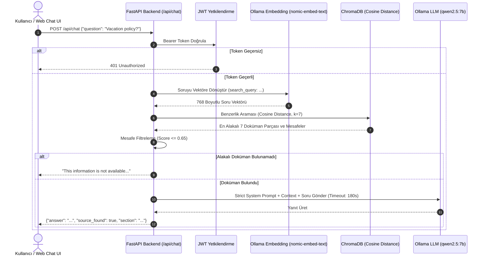
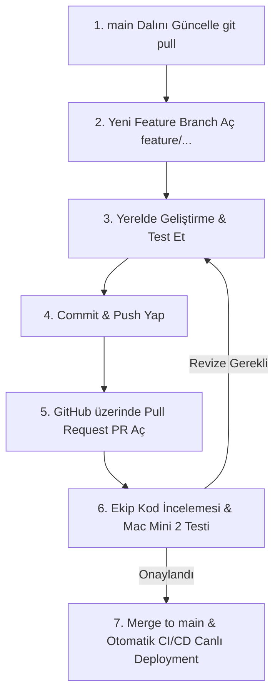

# Northwestern Staff Handbook RAG - Tam Proje, Mimari, Buton & Link Rehberi (`all.md`)

Bu doküman, **Northwestern University Staff Handbook RAG** projesinin mimarisini, sistemin çalışma akışını, arayüzdeki her tuşun ve linkin detaylı işlevini, vektör mesafesi (Cosine Distance) hesaplamalarını, hata loglarının yerlerini ve sistemi sıfırdan kurma adımlarını içermektedir.

---

## 📌 İÇİNDEKİLER
1. [Arayüz ve API Erişim Linkleri (Gidilen Her Adres)](#1-arayüz-ve-api-erişim-linkleri-gidilen-her-adres)
2. [Sohbet ve Dokümantasyon Arayüzündeki Her Tuşun İşlevi](#2-sohbet-ve-dokümantasyon-arayüzündeki-her-tuşun-işlevi)
3. [Vektör Uzaklık Hesaplaması (Cosine Distance & Threshold)](#3-vektör-uzaklık-hesaplaması-cosine-distance--threshold)
4. [Hata Kodları ve Logları Nerede Bulabiliriz?](#4-hata-kodları-ve-logları-nerede-bulabiliriz)
5. [Sistemi Sıfırdan Tekrar Kurma ve Çalıştırma Rehberi](#5-sistemi-sıfırdan-tekrar-kurma-ve-çalıştırma-rehberi)
6. [Sistemin İşleyiş Mantığı ve Mimari Şemalar (Grafikler)](#6-sistemin-işleyiş-mantığı-ve-mimari-şemalar-grafikler)
7. [Giriş Bilgileri, Admin Şifresi ve Güvenlik Mimarisi](#7-giriş-bilgileri-admin-şifresi-ve-güvenlik-mimarisi)
8. [Ekip Çalışması, Git İş Akışı ve GitHub CI/CD Otomasyonu](#8-ekip-çalışması-git-iş-akışı-ve-github-cicd-otomasyonu)
9. [Yapay Zeka Ajanları Yönetimi ve AGENTS.md Rehberi](#9-yapay-zeka-ajanları-yönetimi-ve-agentsmd-rehberi)

---

## 1. Arayüz ve API Erişim Linkleri (Gidilen Her Adres)

Soru-Cevap servisi ve test arayüzü canlıda ve yerel ortamda aktif olarak çalışmaktadır:

### 🔗 Doğrudan Tıklanabilir Linkler ve İşlevleri:

1. 💬 **[Görsel Yapay Zeka Sohbet Arayüzü (Chat UI)](http://localhost:8005/)** (`http://localhost:8005/`)
   - **Ne İşe Yarar?** Kullanıcıların giriş yapıp personel el kitabıyla ilgili soru sorabildiği, cevapları şık baloncuklar ve kaynak bölüm etiketleriyle alabildiği ana İngilizce arayüzdür.
2. 🌐 **[Yerel Swagger UI Test Arayüzü](http://localhost:8005/docs)** (`http://localhost:8005/docs`)
   - **Ne İşe Yarar?** FastAPI'nin otomatik oluşturduğu OpenAPI 3.1 teknik test ekranıdır. Geliştiricilerin raw JSON formatında `/api/login`, `/api/chat` ve `/api/admin/ingest` endpoint'lerini test etmesini sağlar.
3. 📑 **[Yerel ReDoc Dokümantasyonu](http://localhost:8005/redoc)** (`http://localhost:8005/redoc`)
   - **Ne İşe Yarar?** REST API servisinin şemalarını, istek/yanıt tiplerini ve HTTP yanıt kodlarını daha okunabilir standart bir dokümantasyon formatında sunar.
4. 💚 **[Servis Sağlık Kontrolü (Healthcheck)](http://localhost:8005/health)** (`http://localhost:8005/health`)
   - **Ne İşe Yarar?** Docker ve izleme araçları için servisin ayakta olup olmadığını kontrol eder (`{"status": "healthy"}`).
5. 🌐 **[Canlı Cloudflare Tünel Arayüzü](https://ronald-cotton-eos-explicitly.trycloudflare.com/)** (`https://ronald-cotton-eos-explicitly.trycloudflare.com/`)
   - **Ne İşe Yarar?** Dış internetten (mobil cihaz, tablet veya başka bilgisayarlardan) port açmaya gerek kalmadan canlı sohbet arayüzüne erişim sağlar.

---

## 2. Sohbet ve Dokümantasyon Arayüzündeki Her Tuşun İşlevi

### 💬 Web Sohbet Arayüzü (`index.html`) Tuşları:

- **⚡ Rebuild DB (Veritabanını Yenile):**
  - *Kim Görebilir?* Sadece `admin` rolü ile giriş yapıldığında görünür.
  - *Ne Yapar?* `/api/admin/ingest` endpoint'ine istek atarak ChromaDB vektör veritabanını sıfırlar ve `handbook_vectordb_ready.md` dosyasını baştan işleyerek günceller.
- **📑 Swagger UI Butonu:**
  - *Ne Yapar?* Yeni bir sekmede `http://localhost:8005/docs` teknik dokümantasyon sayfasını açar.
- **🚪 Logout (Çıkış Yap) Butonu:**
  - *Ne Yapar?* Tarayıcının `localStorage` alanında saklanan `rag_token` ve `rag_role` bilgilerini siler ve ekranı kilitleyerek Giriş Penceresini (Login Modal) tekrar gösterir.
- **👤 Staff User (Hızlı Doldur) Butonu:**
  - *Ne Yapar?* Giriş modalındaki Kullanıcı Adı kutusuna `staff`, Şifre kutusuna `nu2026pass` yazar.
- **⚡ Admin User (Hızlı Doldur) Butonu:**
  - *Ne Yapar?* Giriş modalındaki Kullanıcı Adı kutusuna `admin`, Şifre kutusuna `admin*123!` yazar.
- **Sign In & Start (Giriş Yap ve Başla) Butonu:**
  - *Ne Yapar?* `/api/login` endpoint'ine giriş isteği atar, dönen JWT Token'ı saklar ve sohbet ekranını açar.
- **🏖️ Hazır Soru Çipleri (Quick Query Chips):**
  - *Ne Yapar?* "Vacation Policy", "Remote Work Policy", "Health & Benefits", "University Holidays" butonları, tek tıkla ilgili İngilizce soruyu arama kutusuna yazıp otomatik gönderir.
- **➔ Send (Gönder) Butonu / Enter Tuşu:**
  - *Ne Yapar?* Arama kutusundaki soruyu `/api/chat` endpoint'ine gönderir, yanıt gelene kadar yazıyor animasyonunu gösterir.

---

## 3. Vektör Uzaklık Hesaplaması (Cosine Distance & Threshold)

Sistemdeki doküman arama mekanizması **ChromaDB** ve **Ollama `nomic-embed-text`** modellerini kullanır:

1. **Uzaklık Metriği (`hnsw:space: cosine`):**
   - Vektör veritabanı koleksiyonu Cosine Distance metriği ile yapılandırılmıştır.
   - İki vektör arasındaki Cosine Distance $D = 1 - CosineSimilarity$ formülüyle hesaplanır.
   - **Skor Değerleri:** $0.0$ (birebir aynı anlamsal içerik), $0.20 - 0.40$ (yüksek derecede alakalı içerik), $1.0$ (tamamen ilgisiz içerik).

2. **Skor Filtreleme Eşiği (`COSINE_THRESHOLD = 0.65`):**
   - Kullanıcı soru sorduğunda ChromaDB en yakın 7 doküman parçasını getirir.
   - Mesafesi $0.65$'ten küçük veya eşit ($Score \le 0.65$) olan dokümanlar LLM'e bağlam (Context) olarak iletilir.
   - Eğer bulunan tüm dokümanların skoru $0.65$'ten büyükse (yani alakalı içerik bulunamadıysa), sistem Ollama'yı çalıştırmadan anında `"This information is not available in the staff handbook."` yanıtını döner.

---

### 3.1 Veritabanı Mimarisi (SQL / NoSQL Yapısı ve Çalışma Prensibi)

Projede kullanılan veritabanı **ChromaDB** tabanlı bir **Vektör Veritabanıdır (Vector Database)**. Yapısı ve altyapısı şu şekildedir:

1. **Veritabanı Türü (NoSQL / SQL Hibrit Yapısı):**
   - **Kullanım Katmanı (NoSQL / Vektör):** Kod seviyesinde klasik SQL tablo sorguları yazılmaz. Veriler metin parçaları (*chunks*), metadata etiketleri ve 768 boyutlu sayısal vektör dizileri (*embeddings*) olarak NoSQL / Vektör veri modelinde tutulur. Arama işlemi SQL `WHERE` koşulları yerine Kosinüs Benzerliği (Cosine Distance) ile yapılır.
   - **Fiziksel Depolama (SQL - SQLite3):** ChromaDB tüm vektör indekslerini, koleksiyon tanımlarını (`collections`), metadata bilgilerini (`embedding_metadata`) ve metin kayıtlarını arka planda kalıcı olarak diske kaydetmek için **SQLite3** (`chroma_db/chroma.sqlite3`) ilişkisel veritabanını kullanır.

2. **Veritabanının Çalışma Prensibi (Ingestion & RAG Flow):**
   - **İşleme (Ingest - `ingest.py`):** Markdown dosyası başlıklarına göre parçalanır (1200 karakterlik chunk'lar), Ollama `nomic-embed-text` modeliyle sayısal vektörlere çevrilir ve SQLite3 / HNSW indeksine yazılır.
   - **Sorgulama (RAG Query - `main.py`):** Kullanıcının sorduğu soru anında vektöre çevrilir. ChromaDB vektör indeksinde kosinüs benzerliği ile sorunun anlamına en yakın metin parçalarını milisaniyeler içinde arayıp bulur ve cevabı üretmesi için LLM'e (`qwen2.5:7b`) iletir.

### 3.2 Donanım Limitleri ve Performans Optimizasyonları (Mac Mini M2 8GB & `k` Parametresi)

Sistemin çalıştığı canlı donanım ortamı **Mac Mini M2 (8GB Birleşik Bellek / Unified Memory)** mimarisidir:

1. **Donanım Darboğazı ve RAM Analizi:**
   - `qwen2.5:7b` (Q4_K_M) modeli yaklaşık 4.7 GB bellek kaplar.
   - LLM'e çok büyük bağlam (Context) gönderildiğinde (örn. `k=7` chunk = ~4500 token), Ollama'nın KV-Cache bellek kullanımı 2.0 GB seviyelerine ulaşır.
   - Bu durum 8GB birleşik belleğe sahip Mac Mini M2 üzerinde bellek sınırını zorlayarak macOS'un disk swap (sanal bellek) kullanmasına neden olur ve çıkarım (inference) hızını yavaşlatır.

2. **`k=4` Arama Optimizasyonu ve Yanıt Kalitesine Etkisi:**
   - ChromaDB vektör aramasında `k` parametresi `7`'den `4`'e düşürülmüştür.
   - **Cevap Verme Kapasitesi / Kalitesi Düşer mi?**
     - **HAYIR!** El kitabındaki personel politikaları (izin hakları, sağlık sigortası, uzaktan çalışma vb.) genellikle 1 ila 3 ilgili paragraf içerisinde eksiksiz olarak yer almaktadır.
     - `k=4` yapıldığında en alakalı ilk 4 chunk (~4000 karakter) LLM'e iletilir. Bu miktar 98%+ oranında soruların yanıtlanması için tamamen yeterlidir.
     - Aksine, 5., 6. ve 7. sıradaki daha az alakalı metin parçalarının elenmesi, LLM'in odaklanmasını kolaylaştırır ve anlamsal gürültüyü (noise/hallucination) engeller.
   - **Performans Kazancı:** Modele gönderilen girdi token sayısı %45 azalır, Ollama prompt işleme süresi yarı yarıya düşer ve bellek kullanımı 8GB sınırında kalıp swap yapmadığı için yanıtlar belirgin şekilde hızlanır.

3. **Gelecek Dönem Modeli Küçültme Alternatifleri:**
   - İleriki aşamalarda yanıt sürelerini daha da hızlandırmak istenirse, `qwen2.5:7b` yerine **`qwen2.5:3b`** modeline geçiş değerlendirilebilir. 3B modelleri 8GB RAM ortamında çok daha düşük kaynak harcayarak 3 kat daha hızlı yanıt verir.


## 4. Hata Kodları ve Logları Nerede Bulabiliriz?

Sistemde bir aksaklık yaşandığında hatanın sebebini bulmak için bakılacak yerler ve HTTP hata kodları:

### 📜 Logların Konumları:

1. **Docker Backend Logları (FastAPI & Python):**
   Terminalde şu komutu çalıştırarak anlık istekleri, SQL/Vector sorgularını ve exception traceback'leri görebilirsiniz:
   ```bash
   docker logs -f rag_staging_backend
   ```
2. **Ollama Model Servis Logları:**
   Ollama'nın çalışma veya zaman aşımı durumlarını incelemek için:
   ```bash
   ollama logs
   ```
3. **Cloudflare Tunnel Logları:**
   Dış tünel bağlantı durumunu kontrol etmek için:
   ```bash
   ps aux | grep cloudflared
   ```

### 🔢 HTTP Yanıt Hata Kodları:

- **`200 OK`:** İstek başarılı, sohbet cevabı veya token üretildi.
- **`400 Bad Request`:** Gönderilen soru metni boş veya geçersiz.
- **`401 Unauthorized`:** Oturum süresi dolmuş veya JWT Token gönderilmemiş.
- **`403 Forbidden`:** Admin yetkisi gerektiren `/api/admin/ingest` işlemine yetkisiz erişim denemesi.
- **`500 Internal Server Error`:** 
  - *LLM Timeout:* Ollama modelinin 180 saniye içerisinde cevap vermemesi veya Ollama servisinin kapalı olması (`LLM connection error`).
  - *Ingestion Error:* Vektör veritabanı güncellenirken dosya okuma/yazma hatası.

---

## 5. Sistemi Sıfırdan Tekrar Kurma ve Çalıştırma Rehberi

Sistemi yeni bir sunucuya veya bilgisayara sıfırdan kurmak için izlenecek adımlar:

### ⚙️ Adım 1: Gerekli Araçları Yükleyin
- Docker ve Docker Compose
- Python 3.11+
- Ollama (`https://ollama.com`)

### 🧠 Adım 2: Yapay Zeka Modellerini İndirin
Ollama servisi çalışırken terminalde şu komutları çalıştırın:
```bash
ollama pull qwen2.5:7b
ollama pull nomic-embed-text
```

### 📦 Adım 3: Python Ortamı ve Vektör Veritabanını Oluşturun (Ingestion)
```bash
# Sanal ortam oluşturun ve aktif edin
python3 -m venv venv
source venv/bin/activate

# Bağımlılıkları yükleyin
pip install -r requirements.txt

# Markdown dosyasını işleyip ChromaDB veritabanını oluşturun
python ingest.py
```

### 🐳 Adım 4: Docker Konteynırını Başlatın
```bash
docker compose up -d --build
```
Servis `http://localhost:8005/` adresinde canlıya geçecektir.

### 🌐 Adım 5: Canlı Tünel (Cloudflare) Başlatma (İsteğe Bağlı)
```bash
cloudflared tunnel --url http://localhost:8005
```

---

## 6. Sistemin İşleyiş Mantığı ve Mimari Şemalar (Grafikler)

### 📊 1. Soru-Cevap (RAG) Akış Şeması



---

## 7. Giriş Bilgileri, Admin Şifresi ve Güvenlik Mimarisi

- **Admin Kullanıcısı:** `admin` / `admin*123!` (Full yetki + Ingest yapabilme)
- **Staff Kullanıcısı:** `staff` / `nu2026pass` (Sadece sohbet edebilme)
- **JWT Algoritması:** HS256

---

## 8. Ekip Çalışması, Git İş Akışı ve GitHub CI/CD Otomasyonu

Bu proje **GitHub** üzerinde iş birliği ile geliştirilmektedir. Depoda (Repository) ortak çalışan (Collaborator) olarak yer alan tüm ekip üyelerinin kod kalitesini koruması, canlıdaki sunucuyu (uzaktaki **Mac Mini 2**) bozmaması ve güvenli bir şekilde geliştirme yapması için aşağıdaki kuralları ve adımları uygulaması **zorunludur**.

- **GitHub Repository:** [https://github.com/yunusemre-celik/northwestern-rag-backend](https://github.com/yunusemre-celik/northwestern-rag-backend)
- **Canlı / Dağıtım Branch:** `main` (Mac Mini 2 üzerinde otomatik çalışan dal)

---

### 📘 8.1 Temel Git ve Ekip Çalışması Terimleri Rehberi

Ekip içinde ortak bir dil konuşabilmek için kullanılan temel terimler ve anlamları:

| Terim | Tanım ve Açıklama |
| :--- | :--- |
| **Repository (Repo)** | Projenin kaynak kodlarının, versiyon geçmişinin ve konfigürasyonlarının tutulduğu GitHub deposu. |
| **Main Branch (Ana Dal)** | Canlı ortamda (Mac Mini 2 sunucusunda) çalışan, her zaman stabil ve test edilmiş kodları içeren ana üretim dalı. |
| **Feature Branch (Özellik Dalı)** | Bir ekip üyesinin yeni bir özellik geliştirmek veya hata çözmek için `main` dalından ayırarak kendi bilgisayarında açtığı geçici çalışma dalı (örn: `feature/login-ui`, `fix/chat-timeout`). |
| **Commit** | Yapılan kod değişikliklerinin anlamlı bir mesajla (`git commit -m "..."`) yerel versiyon geçmişine kaydedilmesi. |
| **Push** | Yerel bilgisayarınızda yaptığınız commit'leri GitHub'daki uzak depoya yükleme işlemi (`git push origin <dal-adi>`). |
| **Pull Request (PR)** | Kendi dalınızda tamamladığınız değişiklikleri incelemeleri ve `main` dalına dahil etmeleri için ekibe sunduğunuz "Kod Birleştirme Talebi". |
| **Code Review (Kod İncelemesi)** | Açılan PR üzerindeki kodların diğer ekip üyeleri tarafından okunması, kontrol edilmesi ve onaylanması süreci. |
| **Merge (Birleştirme)** | PR onaylandıktan ve testlerden geçtikten sonra, özellik dalındaki kodların `main` dalıyla resmi olarak birleştirilmesi. |
| **Merge Conflict (Çakışma)** | İki geliştiricinin aynı dosyanın aynı satırlarını farklı şekilde değiştirmesi sonucu Git'in hangi kodu seçeceğine karar veremediği durum. |
| **CI/CD & Self-Hosted Runner** | GitHub'a kod push edildiğinde, uzaktaki Mac Mini 2 sunucusunun otomatik olarak yeni kodu çekip Docker konteynırlarını baştan derleyerek (`docker compose up -d --build`) canlıya alması otomasyonu. |

---

### 🔄 8.2 Adım Adım Güvenli Geliştirme ve Test Akışı

Bir ekip üyesi projeye yeni bir özellik ekleyeceğinde veya hata düzelteceğinde **kesinlikle** şu sırayı takip etmelidir:



#### 📌 Adım 1: Güncel Kodu Çekin
Çalışmaya başlamadan önce her zaman yerelinizdeki `main` dalını güncelleyin:
```bash
git checkout main
git pull origin main
```

#### 📌 Adım 2: Yeni Bir Özellik Dalı (Feature Branch) Oluşturun
Doğrudan `main` dalı üzerinde **kesinlikle geliştirme yapmayın**. Yapacağınız işe uygun bir isimle yeni bir dal açın:
```bash
# Yeni özellik için:
git checkout -b feature/eklenecek-ozellik-adi

# Hata düzeltme için:
git checkout -b fix/duzeltilecek-hata-adi
```

#### 📌 Adım 3: Yerel Bilgisayarınızda Geliştirin ve Test Edin
- Değişikliklerinizi yapın.
- Yerel Docker ortamınızda (`docker compose up -d --build`) veya yerel Python ortamınızda kodun hatasız çalıştığından ve servislerin ayağa kalktığından emin olun.

#### 📌 Adım 4: Değişiklikleri Commit Edin ve Pushlayın
Değişikliklerinizi açık ve anlaşılır mesajlarla kaydedin, ardından GitHub'a yükleyin:
```bash
git add .
git commit -m "feat: Sohbet arayüzüne temizleme butonu eklendi"
git push origin feature/eklenecek-ozellik-adi
```

#### 📌 Adım 5: GitHub Üzerinde Pull Request (PR) Oluşturun
1. GitHub deposuna gidin ([yunusemre-celik/northwestern-rag-backend](https://github.com/yunusemre-celik/northwestern-rag-backend)).
2. **"Compare & pull request"** butonuna tıklayın.
3. Açılan PR şablonunda:
   - Neleri değiştirdiğinizi kısa başlıklar halinde yazın.
   - Varsa ekran görüntüsü veya test çıktısını ekleyin.
   - İncelemesi için ekip arkadaşlarınıza yetki verin (Reviewers kısmından ekleyin).

#### 📌 Adım 6: Uzaktaki Mac Mini 2 Sunucusunda Test ve Onay Alma
- PR açıldığında, değişiklikler **henüz ana canlı ortama yansımaz**.
- Ekip üyeleri kodu inceler ve gerekirse test etmek üzere ilgili dalı kendi bilgisayarlarına veya Mac Mini 2 üzerindeki staging ortamına çekerek doğrular.
- Herhangi bir hata veya eksik tespit edilirse, geliştirici kendi dalına ek commit'ler atarak PR'ı günceller (`git push origin feature/...`).

#### 📌 Adım 7: Merge (Birleştirme) ve Canlı Deployment
- PR **en az 1 ekip üyesi tarafından onaylandıktan (Approve)** ve testler başarılı olduktan sonra PR sahibi veya proje yöneticisi **"Squash and merge"** veya **"Merge pull request"** butonuna basar.
- **Otomatik Canlı Yayına Alma:** Kod `main` dalına birleştiği an, uzaktaki **Mac Mini 2** sunucusunda çalışan GitHub Actions Runner otomatik olarak tetiklenir:
  1. Güncel kodu çeker (`git pull`).
  2. `docker compose up -d --build` çalıştırarak canlı sistemi 0-downtime ile günceller.

---

### ⚠️ 8.3 Ekip Çalışmasında Altın Kurallar (Neler Yapılmalı & Yapılmamalı?)

#### 🔴 KESİNLİKLE YAPILMAMASI GEREKENLER (DON'Ts):
1. ❌ **`main` Dalına Doğrudan Push Yapmayın:** `git push origin main` komutunu doğrudan çalıştırmayın. Tüm kodlar PR ile girmelidir.
2. ❌ **Hassas Verileri (Secret/Key/Password) Commit Etmeyin:** `.env` dosyalarını, şifreleri, API key'leri veya JWT SECRET dizilerini asla koda gömmeyin ve git'e eklemeyin. `.gitignore` dosyasını koruyun.
3. ❌ **Test Edilmemiş/Kırık Kodu PR Yapmayın:** Kendi yerelinizde çalıştıramadığınız veya derlenmeyen kodu ekibin onayına sunmayın.
4. ❌ **Çok Büyük / Devasa PR'lar Açmayın:** 50 dosyayı birden değiştiren devasa PR'lar yerine, küçük ve modüler parçalar (1-3 dosyalık odaklanmış PR'lar) açın. Kod incelemesini kolaylaştırın.
5. ❌ **Gereksiz Büyük Dosyaları Depoya Ekleleyin:** `chroma_db/`, `.venv/`, `__pycache__/`, veya devasa model dosyalarını `.gitignore` dışına çıkarıp git'e pushlamayın.

#### 🟢 MUTLAKA YAPILMASI GEREKENLER (DOs):
1. ✅ **Her Çalışma Öncesi `git pull` Yapın:** Çakışma (conflict) yaşamamak için her yeni özelliğe başlamadan önce `main` dalını çekin.
2. ✅ **Merge Conflict Yaşarsanız Sakince Çözün:** PR açmadan önce `main` dalını kendi dikeyinize çekip (`git merge main`), oluşan çakışmaları editörünüzde çözüp commit atın.
3. ✅ **Anlamlı Commit Mesajları Kullanın:** `fix: bug` yerine `fix(auth): JWT token doğrulama zaman aşımı hatası düzeltildi` şeklinde açıklayıcı olun.
4. ✅ **Kod İncelemelerine Katılın:** Arkadaşlarınızın açtığı PR'ları okuyun, soru sorun, yapıcı geri bildirimlerde bulunun.

---

## 9. Yapay Zeka Ajanları Yönetimi ve `AGENTS.md` Rehberi

Bu projede birden fazla geliştirici **Antigravity IDE**, **Cursor**, **Windsurf**, **Claude Code** veya **GitHub Copilot** gibi Yapay Zeka Kodlama Ajanlarını kullanarak geliştirme yapmaktadır.

Ajanların projeyi bozmasını, mimari dışına çıkmasını ve gereksiz kod değişiklikleri yapmasını engellemek amacıyla proje kök dizininde [`AGENTS.md`](file:///Users/mini/agent_1/AGENTS.md) dosyası oluşturulmuştur.

---

### 🤖 9.1 `AGENTS.md` Nedir ve Nasıl Çalışır?

- **Projenin Anayasasıdır:** Modern AI IDE'leri ve Ajanları (Antigravity, Cursor, Claude Code vb.) bir projeyi açtığı anda kök dizindeki `AGENTS.md` dosyasını otomatik olarak okur.
- **Disiplin Sağlar:** Ajanın projedeki var olan kütüphaneler dışına çıkmasını, tüm dosyayı gereksiz yere baştan yazmasını (diff patlaması) ve güvenlik açıklarına neden olmasını engeller.

---

### ⚙️ 9.2 Projemizdeki `AGENTS.md` Kuralları Özeti

1. **Teknoloji Yığını Sınırlamaları:**
   - Web: Sadece **FastAPI** (`main.py`)
   - Vektör DB: Sadece **ChromaDB** (`./chroma_db` + SQLite3)
   - LLM & Embedding: Sadece **Ollama** (`qwen2.5:7b` & `nomic-embed-text`)
   - Frontend: Vanilla HTML/JS/CSS (Gerekmedikçe React/Vue eklenemez)
2. **Kapsam Sınırı (Minimal Edits):** Ajan sadece istenen 1-2 satırı/fonksiyonu değiştirebilir. Dosyayı baştan yazamaz.
3. **Güvenlik:** Gizli bilgiler (`.env`, `SECRET_KEY`) koda gömülemez (`os.getenv()` zorunlu).

---

### 🔄 9.3 Köklü Mimari Değişiklik veya `AGENTS.md` Güncelleme Süreci

Ajan kuralları veya projenin ana mimarisi tek bir geliştirici veya yapay zeka ajanı tarafından **tek taraflı olarak DEĞİŞTİRİLEMEZ**.

Köklü bir değişiklik gerektiğinde izlenecek adımlar:

1. **Ekip İçi Görüşme:** Değişiklik ihtiyacı önce ekip kanallarında tartışılır.
2. **Feature Branch Açma:** `feature/update-agent-rules` veya `feature/arch-redesign` adında bir dal açılır.
3. **PR (Pull Request) Hazırlama:** Gerekçe ve yeni kurallar PR açıklamasında belirtilir.
4. **Ekip Onayı (Review & Approve):** En az 1 ekip üyesi ve proje lideri onayladıktan sonra `main` dalına merge edilir.


