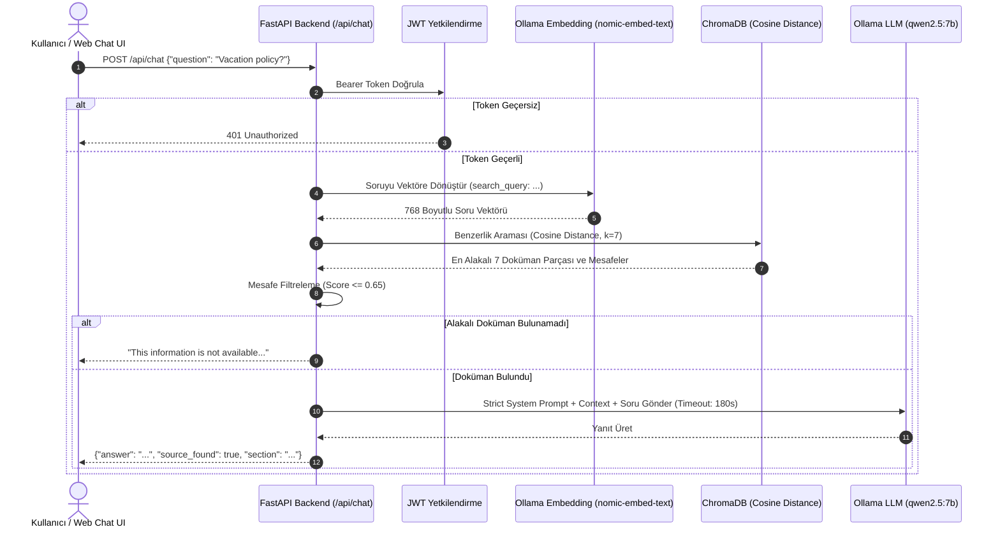

# Northwestern Staff Handbook RAG - Tam Proje, Mimari, Buton & Link Rehberi (`all.md`)

Bu doküman, **Northwestern University Staff Handbook RAG** projesinin mimarisini, sistemin çalışma akışını, arayüzdeki her tuşun ve linkin detaylı işlevini, vektör mesafesi (Cosine Distance) hesaplamalarını, hata loglarının yerlerini ve sistemi sıfırdan kurma adımlarını içermektedir.

---

## 📌 İÇİNDEKİLER
1. [Arayüz ve API Erişim Linkleri (Gidilen Her Adres)](#1-arayüz-ve-api-erişim-linkleri-gidilen-her-adres)
2. [Sohbet ve Dokümantasyon Arayüzündeki Her Tuşun İşlevi](#2-sohbet-ve-dokümantasyon-arayüzündeki-her-tuşun-işlevi)
3. [Vektör Uzaklık Hesaplaması (Cosine Distance & Threshold)](#3-vektör-uzaklık-hesaplaması-cosine-distance--threshold)
4. [Hata Kodları ve Logları Nerede Bulabiliriz?](#4-hata-kodları-ve-logları-nerede-bulabiliriz)
5. [Sistemi Sıfırdan Tekrar Kurma ve Çalıştırma Rehberi](#5-sistemi-sıfırdan-tekrar-kurma-ve-çalıştırma-rehberi)
6. [Sistemin İşleyiş Mantığı ve Mimari Şemalar (Grafikler)](#6-sistemin-işleyiş-mantığı-ve-mimari-şemalar-grafikler)
7. [Giriş Bilgileri, Admin Şifresi ve Güvenlik Mimarisi](#7-giriş-bilgileri-admin-şifresi-ve-güvenlik-mimarisi)
8. [Ekip Çalışması ve GitHub CI/CD Otomasyonu](#8-ekip-çalışması-ve-github-cicd-otomasyonu)

---

## 1. Arayüz ve API Erişim Linkleri (Gidilen Her Adres)

Soru-Cevap servisi ve test arayüzü canlıda ve yerel ortamda aktif olarak çalışmaktadır:

### 🔗 Doğrudan Tıklanabilir Linkler ve İşlevleri:

1. 💬 **[Görsel Yapay Zeka Sohbet Arayüzü (Chat UI)](http://localhost:8005/)** (`http://localhost:8005/`)
   - **Ne İşe Yarar?** Kullanıcıların giriş yapıp personel el kitabıyla ilgili soru sorabildiği, cevapları şık baloncuklar ve kaynak bölüm etiketleriyle alabildiği ana İngilizce arayüzdür.
2. 🌐 **[Yerel Swagger UI Test Arayüzü](http://localhost:8005/docs)** (`http://localhost:8005/docs`)
   - **Ne İşe Yarar?** FastAPI'nin otomatik oluşturduğu OpenAPI 3.1 teknik test ekranıdır. Geliştiricilerin raw JSON formatında `/api/login`, `/api/chat` ve `/api/admin/ingest` endpoint'lerini test etmesini sağlar.
3. 📑 **[Yerel ReDoc Dokümantasyonu](http://localhost:8005/redoc)** (`http://localhost:8005/redoc`)
   - **Ne İşe Yarar?** REST API servisinin şemalarını, istek/yanıt tiplerini ve HTTP yanıt kodlarını daha okunabilir standart bir dokümantasyon formatında sunar.
4. 💚 **[Servis Sağlık Kontrolü (Healthcheck)](http://localhost:8005/health)** (`http://localhost:8005/health`)
   - **Ne İşe Yarar?** Docker ve izleme araçları için servisin ayakta olup olmadığını kontrol eder (`{"status": "healthy"}`).
5. 🌐 **[Canlı Cloudflare Tünel Arayüzü](https://ronald-cotton-eos-explicitly.trycloudflare.com/)** (`https://ronald-cotton-eos-explicitly.trycloudflare.com/`)
   - **Ne İşe Yarar?** Dış internetten (mobil cihaz, tablet veya başka bilgisayarlardan) port açmaya gerek kalmadan canlı sohbet arayüzüne erişim sağlar.

---

## 2. Sohbet ve Dokümantasyon Arayüzündeki Her Tuşun İşlevi

### 💬 Web Sohbet Arayüzü (`index.html`) Tuşları:

- **⚡ Rebuild DB (Veritabanını Yenile):**
  - *Kim Görebilir?* Sadece `admin` rolü ile giriş yapıldığında görünür.
  - *Ne Yapar?* `/api/admin/ingest` endpoint'ine istek atarak ChromaDB vektör veritabanını sıfırlar ve `handbook_vectordb_ready.md` dosyasını baştan işleyerek günceller.
- **📑 Swagger UI Butonu:**
  - *Ne Yapar?* Yeni bir sekmede `http://localhost:8005/docs` teknik dokümantasyon sayfasını açar.
- **🚪 Logout (Çıkış Yap) Butonu:**
  - *Ne Yapar?* Tarayıcının `localStorage` alanında saklanan `rag_token` ve `rag_role` bilgilerini siler ve ekranı kilitleyerek Giriş Penceresini (Login Modal) tekrar gösterir.
- **👤 Staff User (Hızlı Doldur) Butonu:**
  - *Ne Yapar?* Giriş modalındaki Kullanıcı Adı kutusuna `staff`, Şifre kutusuna `nu2026pass` yazar.
- **⚡ Admin User (Hızlı Doldur) Butonu:**
  - *Ne Yapar?* Giriş modalındaki Kullanıcı Adı kutusuna `admin`, Şifre kutusuna `admin*123!` yazar.
- **Sign In & Start (Giriş Yap ve Başla) Butonu:**
  - *Ne Yapar?* `/api/login` endpoint'ine giriş isteği atar, dönen JWT Token'ı saklar ve sohbet ekranını açar.
- **🏖️ Hazır Soru Çipleri (Quick Query Chips):**
  - *Ne Yapar?* "Vacation Policy", "Remote Work Policy", "Health & Benefits", "University Holidays" butonları, tek tıkla ilgili İngilizce soruyu arama kutusuna yazıp otomatik gönderir.
- **➔ Send (Gönder) Butonu / Enter Tuşu:**
  - *Ne Yapar?* Arama kutusundaki soruyu `/api/chat` endpoint'ine gönderir, yanıt gelene kadar yazıyor animasyonunu gösterir.

---

## 3. Vektör Uzaklık Hesaplaması (Cosine Distance & Threshold)

Sistemdeki doküman arama mekanizması **ChromaDB** ve **Ollama `nomic-embed-text`** modellerini kullanır:

1. **Uzaklık Metriği (`hnsw:space: cosine`):**
   - Vektör veritabanı koleksiyonu Cosine Distance metriği ile yapılandırılmıştır.
   - İki vektör arasındaki Cosine Distance $D = 1 - CosineSimilarity$ formülüyle hesaplanır.
   - **Skor Değerleri:** $0.0$ (birebir aynı anlamsal içerik), $0.20 - 0.40$ (yüksek derecede alakalı içerik), $1.0$ (tamamen ilgisiz içerik).

2. **Skor Filtreleme Eşiği (`COSINE_THRESHOLD = 0.65`):**
   - Kullanıcı soru sorduğunda ChromaDB en yakın 7 doküman parçasını getirir.
   - Mesafesi $0.65$'ten küçük veya eşit ($Score \le 0.65$) olan dokümanlar LLM'e bağlam (Context) olarak iletilir.
   - Eğer bulunan tüm dokümanların skoru $0.65$'ten büyükse (yani alakalı içerik bulunamadıysa), sistem Ollama'yı çalıştırmadan anında `"This information is not available in the staff handbook."` yanıtını döner.

---

### 3.1 Veritabanı Mimarisi (SQL / NoSQL Yapısı ve Çalışma Prensibi)

Projede kullanılan veritabanı **ChromaDB** tabanlı bir **Vektör Veritabanıdır (Vector Database)**. Yapısı ve altyapısı şu şekildedir:

1. **Veritabanı Türü (NoSQL / SQL Hibrit Yapısı):**
   - **Kullanım Katmanı (NoSQL / Vektör):** Kod seviyesinde klasik SQL tablo sorguları yazılmaz. Veriler metin parçaları (*chunks*), metadata etiketleri ve 768 boyutlu sayısal vektör dizileri (*embeddings*) olarak NoSQL / Vektör veri modelinde tutulur. Arama işlemi SQL `WHERE` koşulları yerine Kosinüs Benzerliği (Cosine Distance) ile yapılır.
   - **Fiziksel Depolama (SQL - SQLite3):** ChromaDB tüm vektör indekslerini, koleksiyon tanımlarını (`collections`), metadata bilgilerini (`embedding_metadata`) ve metin kayıtlarını arka planda kalıcı olarak diske kaydetmek için **SQLite3** (`chroma_db/chroma.sqlite3`) ilişkisel veritabanını kullanır.

2. **Veritabanının Çalışma Prensibi (Ingestion & RAG Flow):**
   - **İşleme (Ingest - `ingest.py`):** Markdown dosyası başlıklarına göre parçalanır (1200 karakterlik chunk'lar), Ollama `nomic-embed-text` modeliyle sayısal vektörlere çevrilir ve SQLite3 / HNSW indeksine yazılır.
   - **Sorgulama (RAG Query - `main.py`):** Kullanıcının sorduğu soru anında vektöre çevrilir. ChromaDB vektör indeksinde kosinüs benzerliği ile sorunun anlamına en yakın metin parçalarını milisaniyeler içinde arayıp bulur ve cevabı üretmesi için LLM'e (`qwen2.5:7b`) iletir.


---

## 4. Hata Kodları ve Logları Nerede Bulabiliriz?

Sistemde bir aksaklık yaşandığında hatanın sebebini bulmak için bakılacak yerler ve HTTP hata kodları:

### 📜 Logların Konumları:

1. **Docker Backend Logları (FastAPI & Python):**
   Terminalde şu komutu çalıştırarak anlık istekleri, SQL/Vector sorgularını ve exception traceback'leri görebilirsiniz:
   ```bash
   docker logs -f rag_staging_backend
   ```
2. **Ollama Model Servis Logları:**
   Ollama'nın çalışma veya zaman aşımı durumlarını incelemek için:
   ```bash
   ollama logs
   ```
3. **Cloudflare Tunnel Logları:**
   Dış tünel bağlantı durumunu kontrol etmek için:
   ```bash
   ps aux | grep cloudflared
   ```

### 🔢 HTTP Yanıt Hata Kodları:

- **`200 OK`:** İstek başarılı, sohbet cevabı veya token üretildi.
- **`400 Bad Request`:** Gönderilen soru metni boş veya geçersiz.
- **`401 Unauthorized`:** Oturum süresi dolmuş veya JWT Token gönderilmemiş.
- **`403 Forbidden`:** Admin yetkisi gerektiren `/api/admin/ingest` işlemine yetkisiz erişim denemesi.
- **`500 Internal Server Error`:** 
  - *LLM Timeout:* Ollama modelinin 180 saniye içerisinde cevap vermemesi veya Ollama servisinin kapalı olması (`LLM connection error`).
  - *Ingestion Error:* Vektör veritabanı güncellenirken dosya okuma/yazma hatası.

---

## 5. Sistemi Sıfırdan Tekrar Kurma ve Çalıştırma Rehberi

Sistemi yeni bir sunucuya veya bilgisayara sıfırdan kurmak için izlenecek adımlar:

### ⚙️ Adım 1: Gerekli Araçları Yükleyin
- Docker ve Docker Compose
- Python 3.11+
- Ollama (`https://ollama.com`)

### 🧠 Adım 2: Yapay Zeka Modellerini İndirin
Ollama servisi çalışırken terminalde şu komutları çalıştırın:
```bash
ollama pull qwen2.5:7b
ollama pull nomic-embed-text
```

### 📦 Adım 3: Python Ortamı ve Vektör Veritabanını Oluşturun (Ingestion)
```bash
# Sanal ortam oluşturun ve aktif edin
python3 -m venv venv
source venv/bin/activate

# Bağımlılıkları yükleyin
pip install -r requirements.txt

# Markdown dosyasını işleyip ChromaDB veritabanını oluşturun
python ingest.py
```

### 🐳 Adım 4: Docker Konteynırını Başlatın
```bash
docker compose up -d --build
```
Servis `http://localhost:8005/` adresinde canlıya geçecektir.

### 🌐 Adım 5: Canlı Tünel (Cloudflare) Başlatma (İsteğe Bağlı)
```bash
cloudflared tunnel --url http://localhost:8005
```

---

## 6. Sistemin İşleyiş Mantığı ve Mimari Şemalar (Grafikler)

### 📊 1. Soru-Cevap (RAG) Akış Şeması



---

## 7. Giriş Bilgileri, Admin Şifresi ve Güvenlik Mimarisi

- **Admin Kullanıcısı:** `admin` / `admin*123!` (Full yetki + Ingest yapabilme)
- **Staff Kullanıcısı:** `staff` / `nu2026pass` (Sadece sohbet edebilme)
- **JWT Algoritması:** HS256

---

## 8. Ekip Çalışması ve GitHub CI/CD Otomasyonu

Proje deponuza push yapıldığında GitHub Actions self-hosted runner otomatik olarak `docker compose up -d --build` komutunu çalıştırarak sunucuyu günceller:
- **GitHub Repository:** [https://github.com/yunusemre-celik/northwestern-rag-backend](https://github.com/yunusemre-celik/northwestern-rag-backend)
- **Branch:** `main`
