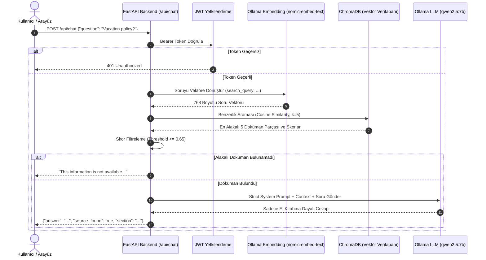
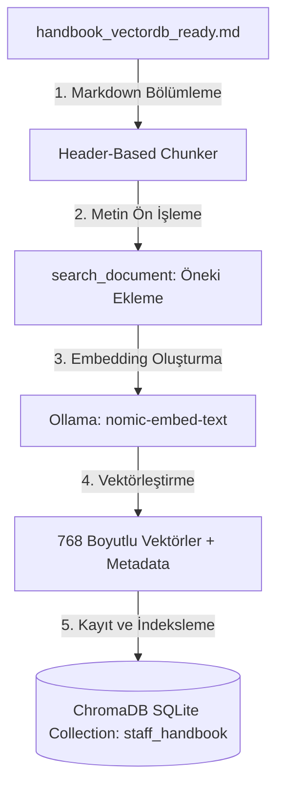
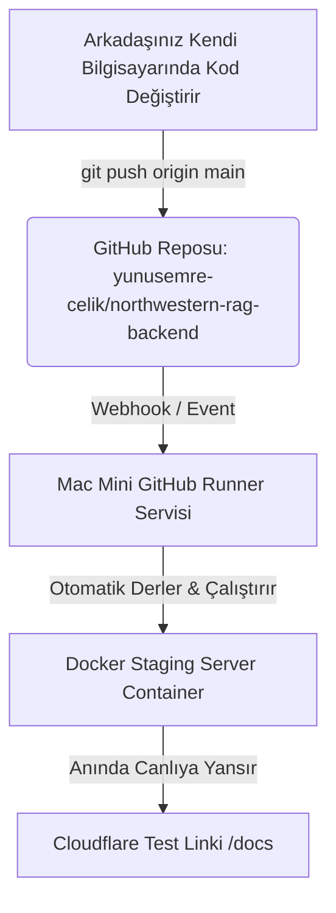

# Northwestern Staff Handbook RAG - Tam Proje, Mimari ve Kullanım Rehberi (`all.md`)

Bu doküman, **Northwestern University Staff Handbook RAG** projesinin mimarisini, sistemin çalışma akışını (grafikler ile), aktif arayüz ve API erişim linklerini, arayüze erişim sorunlarının çözümlerini, yeni katılanlar için adaptasyon rehberini, güvenlik yapılandırmalarını ve mimari alternatifleri (pgvector, NoSQL vb.) içermektedir.

---

## 📌 İÇİNDEKİLER
1. [Arayüz ve API Erişim Linkleri (Direkt Bağlantılar)](#1-arayüz-ve-api-erişim-linkleri-direkt-bağlantılar)
2. [Arayüze Ulaşamama ve Sorun Giderme Rehberi](#2-arayüze-ulaşamama-ve-sorun-giderme-rehberi)
3. [Sistemin İşleyiş Mantığı ve Mimari Şemalar (Grafikler)](#3-sistemin-işleyiş-mantığı-ve-mimari-şemalar-grafikler)
4. [Proje Özeti ve Yapılan İşlemler (Niçin ve Nasıl?)](#4-proje-özeti-ve-yapılan-işlemler-niçin-ve-nasıl)
5. [Yeni Katılanlar İçin Adaptasyon Rehberi (Onboarding / Quick Start)](#5-yeni-katılanlar-için-adaptasyon-rehberi-onboarding--quick-start)
6. [Mimari Tercihler ve Alternatif Seçenekler (pgvector, NoSQL vb.)](#6-mimari-tercihler-ve-alternatif-seçenekler-pgvector-nosql-vb)
7. [Karşılaşılan Teknik Hatalar ve Çözüm Yolları](#7-karşılaşılan-teknik-hatalar-ve-çözüm-yolları)
8. [Giriş Bilgileri, Admin Şifresi ve Güvenlik Mimarisi](#8-giriş-bilgileri-admin-şifresi-ve-güvenlik-mimarisi)
9. [Mac Mini Başlangıç ve Otomatik Açılış (Persistence)](#9-mac-mini-başlangıç-ve-otomatik-açılış-persistence)
10. [Ekip Çalışması ve GitHub CI/CD Otomasyonu](#10-ekip-çalışması-ve-github-cicd-otomasyonu)

---

## 1. Arayüz ve API Erişim Linkleri (Direkt Bağlantılar)

Soru-Cevap servisi ve test arayüzü şu anda canlıda ve yerel ortamda aktif olarak çalışmaktadır. Aşağıdaki linklere tıklayarak doğrudan ulaşabilirsiniz:

### 🔗 Doğrudan Tıklanabilir Linkler:

* 💬 **[Görsel Yapay Zeka Sohbet Arayüzü (Chat UI)](http://localhost:8005/)** -> Kullanıcı dostu sohbet penceresi, otomatik oturum açma ve soru sorma alanı (`http://localhost:8005/`)
* 🌐 **[Yerel Swagger UI Test Arayüzü](http://localhost:8005/docs)** -> Teknik API test alanı ve Swagger dokümantasyonu (`http://localhost:8005/docs`)
* 📑 **[Yerel ReDoc Dokümantasyonu](http://localhost:8005/redoc)** -> Detaylı API dokümantasyonu (`http://localhost:8005/redoc`)
* 💚 **[Servis Sağlık Kontrolü (Healthcheck)](http://localhost:8005/health)** -> Servis çalışma durumu (`http://localhost:8005/health`)
* 🌐 **[Canlı Cloudflare Tünel Arayüzü](https://ronald-cotton-eos-explicitly.trycloudflare.com/)** -> Dış internetten doğrudan erişilebilen canlı sohbet arayüzü (`https://ronald-cotton-eos-explicitly.trycloudflare.com/`).

---

## 2. Arayüze Ulaşamama ve Sorun Giderme Rehberi

Eğer arayüze ulaşamıyorsanız veya soru cevap yaparken hata alıyorsanız aşağıdaki adımları kontrol ediniz:

### ❓ "Arayüze Ulaşamıyorum, Neden Olabilir?"

1. **Yanlış Port Kullanımı:**
   * Proje varsayılan port olan `8000` başka bir servis (`video_downloader_web`) tarafından kullanıldığı için **`8005`** portuna yönlendirilmiştir.
   * `http://localhost:8000` değil, **[http://localhost:8005/](http://localhost:8005/)** (Sohbet Arayüzü) veya **[http://localhost:8005/docs](http://localhost:8005/docs)** (Swagger UI) adresini kullandığınızdan emin olun.

2. **Docker Servisinin Kapalı Olması:**
   * Terminalde `docker ps` komutunu çalıştırın. `rag_staging_backend` konteynerinin `Up` (çalışıyor) durumda olduğunu doğrulayın.
   * Eğer kapalıysa projenin ana dizininde şu komutu çalıştırın:
     ```bash
     docker compose up -d
     ```

3. **Cloudflare Quick Tunnel Bağlantısının Kopması:**
   * Dış tünel adresi (`trycloudflare.com`) geçicidir. Sunucu veya tünel yeniden başladığında tünel linki yenilenebilir.
   * Kendi bilgisayarınızdan test yapıyorsanız her zaman **[http://localhost:8005/](http://localhost:8005/)** adresini kullanın.

4. **Soru-Cevap Yaparken Oturum ve Token Yönetimi:**
   * Web Sohbet Arayüzünde (`http://localhost:8005/`) ekranda çıkan giriş penceresinden **Staff Girişi** (`staff` / `nu2026pass`) veya **Admin Girişi** (`admin` / `admin*123!`) butonlarına tıklayarak tek tıkla otomatik giriş yapabilirsiniz.
   * Swagger UI (`/docs`) üzerinden manuel test yaparken `/api/login` endpoint'inden token alıp `Authorize` 🔓 butonuna yapıştırmanız gerekmektedir.

5. **Görsel Frontend Arayüzü:**
   * Projeye dahili **HTML5/CSS3/JS Web Sohbet Arayüzü** entegre edilmiştir. Kök dizin olan `http://localhost:8005/` adresine girildiğinde otomatik açılmaktadır.

---

## 3. Sistemin İşleyiş Mantığı ve Mimari Şemalar (Grafikler)

Proje, doküman arama (Retrieval) ve yapay zeka cevap üretme (Generation) süreçlerini birleştiren **RAG (Retrieval-Augmented Generation)** mimarisine sahiptir.

### 📊 1. Soru-Cevap (RAG) Akış Şeması

Kullanıcının bir soru sormasından cevabın üretilmesine kadar geçen süreç:



### 📊 2. Veri İndeksleme (Ingestion) Akış Şeması

Northwestern Staff Handbook dokümanının vektör veritabanına işlenme süreci:



---

## 4. Proje Özeti ve Yapılan İşlemler (Niçin ve Nasıl?)

### 🎯 Amaç
Northwestern University Staff Handbook (Personel El Kitabı) dokümanını okumuş, yerel yapay zeka (Ollama `qwen2.5:7b` + `nomic-embed-text`) ile çalışan RAG (Retrieval-Augmented Generation) backend servisini **Dockerize etmek**, dış internete **Staging Sunucusu** olarak açmak, güvenlik zafiyetlerini kapatmak ve GitHub Actions ile **otomatik CI/CD** otomasyonuna bağlamaktır.

### 🛠️ Sırasıyla Yapılan Değişiklikler:
1. **Bağımlılık Yönetimi (`requirements.txt`):** `fastapi`, `uvicorn`, `langchain-community`, `chromadb`, `python-jose`, `pydantic` sürümleri tanımlandı.
2. **Ortam Değişkenleri (`.env` ve `.env.example`):** Kod içinde sabit olan Ollama URL'leri, gizli JWT anahtarları ve şifreler koda gömülü olmaktan çıkarıldı.
3. **Backend Refactoring (`main.py`):** Konteyner sağlığını izlemek için `/health` endpoint'i eklendi. Dynamic CORS ve JWT Admin korumalı `/api/admin/ingest` yazıldı.
4. **Vektör Veritabanı Güncelleme Yapısı (`ingest.py`):** ChromaDB SQLite dosya kilidi hatasını önlemek için `delete_collection()` + `add_documents()` yapısına geçildi.
5. **Konteynerleştirme (`Dockerfile` ve `docker-compose.yml`):** `python:3.11-slim` tabanlı imaj, `HEALTHCHECK`, host Ollama servisine erişim için `extra_hosts` (`host.docker.internal`), `1.5G` bellek limiti ve `name: rag_staging` tanımlandı.
6. **GitHub Actions Runner & Otomasyon (`deploy.yml`):** Self-Hosted Runner üzerinden otomatik CI/CD iş akışı kuruldu.
7. **Dış İnternet Tüneli:** Port 8005 dış internete güvenli Cloudflare HTTPS bağlantısı ile açıldı.

---

## 5. Yeni Katılanlar İçin Adaptasyon Rehberi (Onboarding / Quick Start)

Bu projeye yeni katılan bir geliştiricinin projeyi kendi bilgisayarında çalıştırması ve geliştirmeye başlaması için takip etmesi gereken adımlar:

### 🚀 Adım Adım Kurulum Rehberi:

#### 1. Ön Gereksinimler
* Python 3.11+
* Docker & Docker Compose
* Ollama (Mac/Linux/Windows üzerinde kurulu ve açık)

#### 2. Ollama Modellerini İndirme
Terminalde şu komutları çalıştırarak gerekli yapay zeka modellerini indirin:
```bash
ollama pull qwen2.5:7b
ollama pull nomic-embed-text
```

#### 3. Repoyu Klonlama ve Hazırlık
```bash
git clone https://github.com/yunusemre-celik/northwestern-rag-backend.git
cd northwestern-rag-backend
cp .env.example .env
```

#### 4. Projeyi Docker ile Çalıştırma (Tavsiye Edilen)
```bash
docker compose up -d --build
```
* Servis başladıktan sonra **[http://localhost:8005/docs](http://localhost:8005/docs)** adresine giderek arayüzü açabilirsiniz.

#### 5. Lokal Python Ortamında Çalıştırma (Geliştirici Modu)
```bash
python3 -m venv venv
source venv/bin/activate
pip install -r requirements.txt
python ingest.py  # Vektör veritabanını oluşturur
uvicorn main:app --reload --port 8005
```

---

## 6. Mimari Tercihler ve Alternatif Seçenekler (pgvector, NoSQL vb.)

Proje tasarlanırken belirli bileşenler seçilmiştir. Ancak projenin büyümesi veya farklı ihtiyaçlar doğrultusunda kullanılabilecek alternatif teknolojiler ve karşılaştırmaları aşağıda sunulmuştur:

| Bileşen | Mevcut Seçim | Alternatif Seçenekler | Karşılaştırma & Neden Tercih Edilebilir? |
| :--- | :--- | :--- | :--- |
| **Vektör Veritabanı** | **ChromaDB** *(Local SQLite)* | **pgvector** *(PostgreSQL)*<br>**Qdrant** / **Milvus** / **Pinecone** | • **Mevcut (ChromaDB):** Kurulumu sıfır konfigürasyon gerektirir, yerel dosya tabanlıdır, küçük/orta ölçekli projeler için mükemmeldir.<br>• **pgvector (PostgreSQL):** Üretim (Production) ortamında kullanıcı verileri, ilişkisel tablolar ve vektörlerin **tek bir PostgreSQL veritabanında** tutulmasını sağlar. Ayrı bir vektör DB yönetme ihtiyacını kaldırır ve ACID garantisi sunar.<br>• **Qdrant / Milvus:** Milyonlarca dokümanın olduğu yüksek trafikli ve dağıtık sistemler için idealdir. |
| **Veri Depolama & Loglama** | **SQLite / File System** | **NoSQL (MongoDB / Redis / DynamoDB)**<br>**Relational DB (PostgreSQL)** | • **Mevcut:** Dokümanlar Markdown ve Chroma SQLite içinde saklanır.<br>• **NoSQL (MongoDB / Redis):** Kullanıcı sohbet geçmişlerini (chat history), oturum (session) durumlarını ve esnek JSON formatındaki logları saklamak için NoSQL ideal bir seçenektir.<br>• **PostgreSQL:** Kullanıcı yönetimi, rol ve izin matrisleri için uygundur. |
| **Embedding & LLM Servisi** | **Yerel Ollama**<br>*(qwen2.5:7b + nomic-embed-text)* | **OpenAI API** *(GPT-4o / text-embedding-3)*<br>**vLLM** / **HuggingFace** | • **Mevcut (Ollama):** Veri gizliliği %100 yereldir, hiçbir veri dışarı çıkmaz ve API maliyeti sıfırdır.<br>• **OpenAI / Anthropic:** Donanım kaynağı kısıtlı olduğunda veya daha yüksek akıl yürütme (reasoning) kapasitesi istendiğinde tercih edilir. |
| **Kullanıcı Arayüzü (UI)** | **FastAPI Swagger UI** | **Streamlit / Gradio**<br>**React / Next.js** | • **Mevcut (Swagger UI):** API geliştiricileri için hızlı interaktif test ortamı sunar.<br>• **Streamlit:** Python koduyla 10 satırda görsel sohbet penceresi (Chat UI) oluşturur.<br>• **React / Next.js:** Son kullanıcıya yönelik kurumsal arayüzler için tercih edilir. |

---

## 7. Karşılaşılan Teknik Hatalar ve Çözüm Yolları

Süreç boyunca karşılaşılan 6 kritik teknik problem ve çözümleri:

### ❌ Hata 1: Ollama Bağlantı Hatası (`Connection Refused / Network Unreachable`)
* **Nedeni:** macOS üzerindeki Ollama varsayılan olarak sadece `127.0.0.1` dinler. Docker konteyneri `host.docker.internal` üzerinden eriştiğinde istek reddedildi.
* **Çözümü:** Mac Mini üzerinde Ollama servisi `OLLAMA_HOST=0.0.0.0`, `OLLAMA_NUM_PARALLEL=1` ve `OLLAMA_KEEP_ALIVE=24h` parametreleri ile başlatıldı. `docker-compose.yml` dosyasına `extra_hosts: - "host.docker.internal:host-gateway"` eklendi.

### ❌ Hata 2: Host Port 8000 Çakışması (`Bind for 0.0.0.0:8000 failed: port is already allocated`)
* **Nedeni:** Mac Mini üzerindeki 8000 portu `video_downloader_web` konteyneri tarafından zaten kullanılıyordu.
* **Çözümü:** `.env` ve `docker-compose.yml` dosyalarında dış port `HOST_PORT=8005` olarak ayarlandı (`8005:8000`).

### ❌ Hata 3: ChromaDB SQLite Dosya Kilidi (`[Errno 16] Device or resource busy: './chroma_db'`)
* **Nedeni:** Re-ingest esnasında `shutil.rmtree('./chroma_db')` çalıştırıldığında açık SQLite bağlantıları nedeniyle dosya silinemedi.
* **Çözümü:** `ingest.py` içinde dizin silme yerine var olan koleksiyonu `vector_store.delete_collection()` ile temizleyip `vector_store.add_documents(chunks)` ile veri ekleme yapısına geçildi. Ayrıca `main.py` içinde re-ingest öncesi `vector_store._client.close()` çağrıldı.

### ❌ Hata 4: GitHub Push Yetki Reddi (`refusing to allow PAT without workflow scope`)
* **Nedeni:** Kullanıcının GitHub Personal Access Token (PAT) anahtarında `.github/workflows/deploy.yml` dosyasını değiştirmek için gerekli `workflow` yetkisi eksikti.
* **Çözümü:** GitHub üzerinde `repo` ve `workflow` yetkileri aktif edilmiş yeni bir PAT (`ghp_...`) üretildi ve git remote adresine bağlandı.

### ❌ Hata 5: GitHub Runner `docker: command not found` Hatası
* **Nedeni:** macOS `launchd` arka plan servisleri varsayılan olarak `/opt/homebrew/bin` (Homebrew Docker komutları) yolunu `PATH` içinde barındırmaz.
* **Çözümü:** `.github/workflows/deploy.yml` dosyasına `env: PATH: /opt/homebrew/bin:/usr/local/bin:/usr/bin:/bin:/usr/sbin:/sbin` ve `HOME: /Users/mini` değişkenleri eklendi.

### ❌ Hata 6: Docker Compose Proje İsmi Çakışması (`Conflict. Conflict. Container name /rag_staging_backend is already in use`)
* **Nedeni:** Farklı klasör yollarından (`/Users/mini/agent_1` vs `/Users/mini/actions-runner/_work/...`) çalıştırılan docker compose komutları farklı proje isimleri ürettiği için konteyner ismini çakıştırdı.
* **Çözümü:** `docker-compose.yml` dosyasının en üstüne sabit `name: rag_staging` tanımı eklendi ve `deploy.yml` içine `docker rm -f rag_staging_backend || true` adımı eklendi.

---

## 8. Giriş Bilgileri, Admin Şifresi ve Güvenlik Mimarisi

### 🔑 Kullanıcı Giriş Bilgileri:
* **Admin Kullanıcısı:** `admin` | **Şifre:** `admin*123!` *(JWT Role: `admin`)*
* **Personel Kullanıcısı:** `staff` | **Şifre:** `nu2026pass` *(JWT Role: `user`)*

### 🛡️ Güvenlik Önlemleri:
1. **JWT (JSON Web Token) Koruması:** `/api/chat` ve `/api/admin/ingest` endpoint'leri şifresiz isteklere `401 Unauthorized` hatası döner.
2. **Rol Bazlı Yetkilendirme (RBAC):** `/api/admin/ingest` endpoint'ini sadece `admin` kullanıcısı çalıştırabilir.
3. **RAM Sınırı (OOM Koruması):** Mac Mini 8GB RAM'e sahip olduğu için Docker konteyneri `1.5G` ile sınırlandırılmıştır.
4. **CORS Koruması:** İstenmeyen domainlerden gelen istekleri engellemek için ortam değişkeninden kontrol edilir.

---

## 9. Mac Mini Başlangıç ve Otomatik Açılış (Persistence)

* **Docker Backend Konteyneri (`rag_staging_backend`):** `restart: unless-stopped` ayarı sayesinde Mac Mini açılıp Docker çalıştığı an otomatik olarak başlar.
* **GitHub Actions Runner:** macOS `LaunchAgent` servisi olarak kurulmuştur (`actions.runner...plist`). Oturum açıldığında otomatik başlar.
* **Ollama Servisi:** Mac Mini başlangıcında `OLLAMA_HOST=0.0.0.0` ile açılması için macOS *System Settings -> General -> Login Items* (Giriş Öğeleri) kısmına eklenebilir.

---

## 10. Ekip Çalışması ve GitHub CI/CD Otomasyonu

Arkadaşlarınız koda katkı yaptığında sistem otomatik olarak canlıda güncellenir:



### Ekip Arkadaşının Takip Edeceği Adımlar:
1. Repoyu bilgisayarına klonlar:
   `git clone https://github.com/yunusemre-celik/northwestern-rag-backend.git`
2. Kendi editöründe kodda değişiklik yapar.
3. Kodu GitHub'a push eder:
   `git add .`  
   `git commit -m "yeni özellik"`  
   `git push origin main`
4. **Sonuç:** Mac Mini üzerindeki Runner bunu 5 saniye içinde algılar, Docker konteynerini yeniler ve yapılan değişiklik **anında `trycloudflare.com/docs` adresinde canlıya yansır!**
