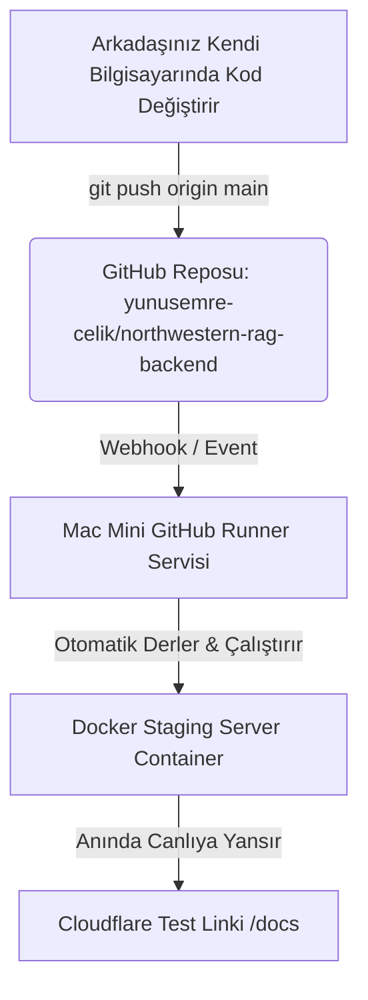

# Northwestern Staff Handbook RAG - Tam Proje ve Mimari Rehberi (`all.md`)

Bu doküman, **Northwestern University Staff Handbook RAG** projesinin başından sonuna kadar yapılan tüm geliştirmelerini, mimari kararlarını, karşılaşılan teknik aksaklıkları ve çözümlerini, erişim linklerini, güvenlik yapılandırmalarını ve ekip çalışma akışını içermektedir.

---

## 📌 İÇİNDEKİLER
1. [Proje Özeti ve Yapılan İşlemler (Niçin ve Nasıl?)](#1-proje-özeti-ve-yapılan-işlemler-niçin-ve-nasıl)
2. [Karşılaşılan Teknik Hatalar ve Çözüm Yolları](#2-karşılaşılan-teknik-hatalar-ve-çözüm-yolları)
3. [Aktif Erişim Linkleri, İşlevleri ve Kullanım Şekli](#3-aktif-erişim-linkleri-işlevleri-ve-kullanım-şekli)
4. [Giriş Bilgileri, Admin Şifresi ve Güvenlik Mimari](#4-giriş-bilgileri-admin-şifresi-ve-güvenlik-mimari)
5. [Mac Mini Başlangıç ve Otomatik Açılış (Persistence)](#5-mac-mini-başlangıç-ve-otomatik-açılış-persistence)
6. [Ekip Çalışması ve GitHub CI/CD Otomasyonu](#6-ekip-çalışması-ve-github-cicd-otomasyonu)

---

## 1. Proje Özeti ve Yapılan İşlemler (Niçin ve Nasıl?)

### 🎯 Amaç
Northwestern University Staff Handbook (Personel El Kitabı) dokümanını okumuş, yerel yapay zeka (Ollama `qwen2.5:7b` + `nomic-embed-text`) ile çalışan RAG (Retrieval-Augmented Generation) backend servisini **Dockerize etmek**, dış internete **Staging Sunucusu** olarak açmak, güvenlik zafiyetlerini kapatmak ve GitHub Actions ile **otomatik CI/CD** otomasyonuna bağlamaktır.

### 🛠️ Sırasıyla Yapılan Değişiklikler:
1. **Bağımlılık Yönetimi (`requirements.txt`):**
   * *Neden:* Docker imajında Python paketlerinin sabit ve eksiksiz yüklenebilmesi için `fastapi`, `uvicorn`, `langchain-community`, `chromadb`, `python-jose`, `pydantic` sürümleri tanımlandı.
2. **Ortam Değişkenleri (`.env` ve `.env.example`):**
   * *Neden:* Kod içinde sabit (hardcoded) olan Ollama URL'leri, gizli JWT anahtarları ve şifreler koda gömülü olmaktan çıkarıldı.
3. **Backend Refactoring (`main.py`):**
   * *Neden:* Konteyner sağlığını izlemek için `/health` endpoint'i eklendi. `allow_origins=["*"]` olan CORS yapısı dinamik hale getirildi. Canlıda veritabanını yenilemek için JWT Admin korumalı `/api/admin/ingest` endpoint'i yazıldı.
4. **Vektör Veritabanı Güncelleme Yapısı (`ingest.py`):**
   * *Neden:* ChromaDB SQLite dosya kilidi hatası vermesin diye `shutil.rmtree` kaldırılıp `delete_collection()` + `add_documents()` yapısına geçildi.
5. **Konteynerleştirme (`Dockerfile` ve `docker-compose.yml`):**
   * *Neden:* `python:3.11-slim` tabanlı hafif imaj, `HEALTHCHECK` direktifi, host Ollama servisine erişim için `extra_hosts` (`host.docker.internal`), 8GB Mac Mini RAM'ini korumak için `1.5G` bellek limiti ve çakışmaları önlemek için `name: rag_staging` proje ismi tanımlandı.
6. **GitHub Actions Runner & Otomasyon (`deploy.yml`):**
   * *Neden:* Mac Mini'ye Self-Hosted Runner kuruldu ve `push` yapıldığında otomatik `docker compose build && docker compose up -d` çalıştıran sıfır kesintili (zero-downtime) CI/CD iş akışı kuruldu.
7. **Dış İnternet Tüneli (Cloudflare Quick Tunnel):**
   * *Neden:* Port 8005 dış internete güvenli HTTPS bağlantısı ile açıldı.

---

## 2. Karşılaşılan Teknik Hatalar ve Çözüm Yolları

Süreç boyunca karşılaşılan 6 kritik teknik problem ve çözümleri:

### ❌ Hata 1: Ollama Bağlantı Hatası (`Connection Refused / Network Unreachable`)
* **Nedeni:** macOS üzerindeki Ollama varsayılan olarak sadece `127.0.0.1` dinler. Docker konteyneri `host.docker.internal` üzerinden eriştiğinde istek reddedildi.
* **Çözümü:** Mac Mini üzerinde Ollama servisi `OLLAMA_HOST=0.0.0.0`, `OLLAMA_NUM_PARALLEL=1` ve `OLLAMA_KEEP_ALIVE=24h` parametreleri ile başlatıldı. `docker-compose.yml` dosyasına `extra_hosts: - "host.docker.internal:host-gateway"` eklendi.

### ❌ Hata 2: Host Port 8000 Çakışması (`Bind for 0.0.0.0:8000 failed: port is already allocated`)
* **Nedeni:** Mac Mini üzerindeki 8000 portu `video_downloader_web` konteyneri tarafından zaten kullanılıyordu.
* **Çözümü:** `.env` ve `docker-compose.yml` dosyalarında dış port `HOST_PORT=8005` olarak ayarlandı (`8005:8000`).

### ❌ Hata 3: ChromaDB SQLite Dosya Kilidi (`[Errno 16] Device or resource busy: './chroma_db'`)
* **Nedeni:** Re-ingest esnasında `shutil.rmtree('./chroma_db')` çalıştırıldığında açık SQLite bağlantıları nedeniyle dosya silinemedi.
* **Çözümü:** `ingest.py` içinde dizin silme yerine var olan koleksiyonu `vector_store.delete_collection()` ile temizleyip `vector_store.add_documents(chunks)` ile veri ekleme yapısına geçildi. Ayrıca `main.py` içinde re-ingest öncesi `vector_store._client.close()` çağrıldı.

### ❌ Hata 4: GitHub Push Yetki Reddi (`refusing to allow PAT without workflow scope`)
* **Nedeni:** Kullanıcının GitHub Personal Access Token (PAT) anahtarında `.github/workflows/deploy.yml` dosyasını değiştirmek için gerekli `workflow` yetkisi eksikti.
* **Çözümü:** GitHub üzerinde `repo` ve `workflow` yetkileri aktif edilmiş yeni bir PAT (`ghp_...`) üretildi ve git remote adresine bağlandı.

### ❌ Hata 5: GitHub Runner `docker: command not found` Hatası
* **Nedeni:** macOS `launchd` arka plan servisleri varsayılan olarak `/opt/homebrew/bin` (Homebrew Docker komutları) yolunu `PATH` içinde barındırmaz.
* **Çözümü:** `.github/workflows/deploy.yml` dosyasına `env: PATH: /opt/homebrew/bin:/usr/local/bin:/usr/bin:/bin:/usr/sbin:/sbin` ve `HOME: /Users/mini` değişkenleri eklendi.

### ❌ Hata 6: Docker Compose Proje İsmi Çakışması (`Conflict. Container name /rag_staging_backend is already in use`)
* **Nedeni:** Farklı klasör yollarından (`/Users/mini/agent_1` vs `/Users/mini/actions-runner/_work/...`) çalıştırılan docker compose komutları farklı proje isimleri ürettiği için konteyner ismini çakıştırdı.
* **Çözümü:** `docker-compose.yml` dosyasının en üstüne sabit `name: rag_staging` tanımı eklendi ve `deploy.yml` içine `docker rm -f rag_staging_backend || true` adımı eklendi.

---

## 3. Aktif Erişim Linkleri, İşlevleri ve Kullanım Şekli

Şu an canlıda aktif olan dış tünel linkleriniz:

| Link / Endpoint | İşlevi | Nasıl Kullanılır? |
| :--- | :--- | :--- |
| 🌐 **[Swagger UI Test Arayüzü](https://viruses-aud-fashion-quest.trycloudflare.com/docs)** | **İnteraktif Görsel Test Arayüzü** | Tarayıcıda açılır. `Authorize` butonuna tıklanıp `admin` / `admin*123!` girilerek tüm API'ler görsel olarak test edilir. |
| 💬 `POST /api/chat` | **RAG Soru-Cevap API** | Header: `Authorization: Bearer <TOKEN>` Body: `{"question": "What are the holidays?"}` |
| 🔑 `POST /api/login` | **Kullanıcı Girişi** | Body: `{"username": "admin", "password": "admin*123!"}` ➡️ Yanıt olarak JWT Token döner. |
| 💚 `GET /health` | **Sağlık Kontrolü** | `https://viruses-aud-fashion-quest.trycloudflare.com/health` ➡️ `{"status": "healthy"}` |
| 🔄 `POST /api/admin/ingest` | **Canlı Veri İndeksleme** | Header: `Authorization: Bearer <ADMIN_TOKEN>` ➡️ Markdown el kitabını yeniden vektör veritabanına işler. |

---

## 4. Giriş Bilgileri, Admin Şifresi ve Güvenlik Mimari

### 🔑 Kullanıcı Giriş Bilgileri:
* **Admin Kullanıcısı:** `admin` | **Şifre:** `admin*123!` *(JWT Role: `admin`)*
* **Personel Kullanıcısı:** `staff` | **Şifre:** `nu2026pass` *(JWT Role: `user`)*

### 🛡️ Güvenlik Önlemleri:
1. **JWT (JSON Web Token) Koruması:** `/api/chat` ve `/api/admin/ingest` endpoint'leri şifresiz isteklere `401 Unauthorized` hatası döner.
2. **Rol Bazlı Yetkilendirme (RBAC):** `/api/admin/ingest` endpoint'ini sadece `admin` kullanıcısı çalıştırabilir.
3. **RAM Sınırı (OOM Koruması):** Mac Mini 8GB RAM'e sahip olduğu için Docker konteyneri `1.5G` ile sınırlandırılmıştır.
4. **CORS Koruması:** İstenmeyen domainlerden gelen istekleri engellemek için ortam değişkeninden kontrol edilir.

---

## 5. Mac Mini Başlangıç ve Otomatik Açılış (Persistence)

* **Docker Backend Konteyneri (`rag_staging_backend`):** `restart: unless-stopped` ayarı sayesinde Mac Mini açılıp Docker çalıştığı an otomatik olarak başlar.
* **GitHub Actions Runner:** macOS `LaunchAgent` servisi olarak kurulmuştur (`actions.runner...plist`). Oturum açıldığında otomatik başlar.
* **Ollama Servisi:** Mac Mini başlangıcında `OLLAMA_HOST=0.0.0.0` ile açılması için macOS *System Settings -> General -> Login Items* (Giriş Öğeleri) kısmına eklenebilir.

---

## 6. Ekip Çalışması ve GitHub CI/CD Otomasyonu

Arkadaşlarınız koda katkı yaptığında sistem otomatik olarak canlıda güncellenir:

### Ekip Arkadaşının Takip Edeceği Adımlar:
1. Repoyu bilgisayarına klonlar:
   `git clone https://github.com/yunusemre-celik/northwestern-rag-backend.git`
2. Kendi editöründe kodda değişiklik yapar.
3. Kodu GitHub'a push eder:
   `git add .`  
   `git commit -m "yeni özellik"`  
   `git push origin main`
4. **Sonuç:** Mac Mini üzerindeki Runner bunu 5 saniye içinde algılar, Docker konteynerini yeniler ve yapılan değişiklik **anında `trycloudflare.com/docs` adresinde canlıya yansır!**
